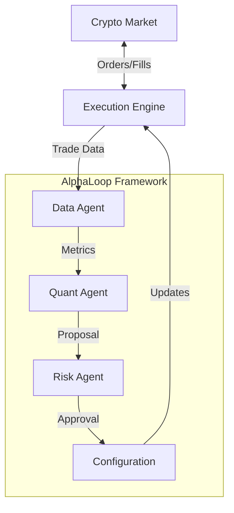

# MarketMakerDemo / 做市商演示


## 📄 Project Baseline

The project baseline overview is documented in [Project Baseline](docs/project_baseline.md).

## 🤖 Introduction / 简介
**MarketMakerDemo** is an autonomous, self-optimizing market making bot designed for crypto markets. Unlike traditional bots with static logic, this system continuously analyzes its own performance and adapts its strategy in real-time.
**MarketMakerDemo** 是一个专为加密市场设计的自主、自我优化的做市商机器人。与具有静态逻辑的传统机器人不同，该系统持续分析自身性能并实时调整策略。

It is powered by **AlphaLoop**, an agentic framework where specialized AI agents (Quant, Risk, Operations) collaborate to manage the trading business.
它由 **AlphaLoop** 驱动，这是一个智能体框架，专门的 AI 智能体（量化、风控、运营）在此协作管理交易业务。

---

## 🧠 Powered by AlphaLoop / 由 AlphaLoop 驱动
This bot is not just a script; it's a digital organization.
这个机器人不仅仅是一个脚本；它是一个数字组织。

### The Core Loop / 核心循环
1.  **Trade**: The bot executes a `FixedSpreadStrategy`.
2.  **Analyze**: The **Quant Agent** reviews performance metrics (Sharpe Ratio, Win Rate).
3.  **Propose**: If performance is suboptimal, the Quant proposes changes (e.g., "Widen spread to 0.3%").
4.  **Validate**: The **Risk Agent** checks the proposal against strict safety limits.
5.  **Optimize**: If approved, the system updates its configuration instantly.

---

## 📚 Documentation Reading Guide / 文档阅读指南

This project has comprehensive documentation. **If you are new to the system**, follow this reading order:
本项目有完整的文档。**如果您是新手**，请按以下顺序阅读：

### 🎯 For First-Time Readers / 初次阅读者

**Start Here:**
1. **[System Flow](docs/system_flow.md)** ⭐ **READ THIS FIRST**
   - Understand what happens when you click "Start Bot"
   - See the complete interaction flow with diagrams
   - **从这里开始** - 了解点击"启动 Bot"后发生的事情

2. **[Walkthrough](docs/walkthrough.md)**
   - See the system in action with real examples
   - Verification results and proof of work
   - 查看系统运行的实际示例

3. **[Architecture](docs/architecture.md)**
   - High-level system design
   - Component relationships and data flow
   - 高层系统设计和组件关系

### 🔧 For Developers / 开发者

**After understanding the basics, dive deeper:**

4. **[Trading Strategy](docs/trading_strategy.md)**
   - How the market-making strategy works
   - Spread calculation and order placement logic
   - 做市策略的工作原理

5. **[Implementation Plan](docs/implementation_plan.md)**
   - Recent changes and planned features
   - Technical details of implementations
   - 最近的更改和计划功能

6. **[Development Protocol](docs/development_protocol.md)**
   - Mandatory development standards
   - Testing requirements and coverage goals
   - 强制性开发标准和测试要求

7. **[CI/CD Process](docs/cicd.md)** 🆕
   - Automated testing and deployment pipeline
   - Quality gates and pre-commit checklist
   - 自动化测试和部署流程

8. **[Dashboard Guide](docs/dashboard.md)** 🆕
   - Monitoring metrics and charts
   - Professional definitions of KPIs
   - 监控指标和图表
   - KPI 的专业定义

9. **AlphaLoop Framework Documentation** (docs/alphaloop/)
   - **[Framework Design](docs/alphaloop/framework_design.md)**: The "Agent-First" architecture
     - 框架设计 - "智能体优先"架构
   - **[Agent Roles and Hierarchy](docs/alphaloop/agent_roles_and_hierarchy.md)**: Meet the AI agents
     - 智能体角色和层级 - 了解各个 AI 智能体
   - **[Agent Workflows](docs/alphaloop/agent_workflows.md)**: How agents collaborate
     - 智能体工作流 - 智能体如何协作
   - **[Metrics Specification](docs/alphaloop/metrics_specification.md)**: KPIs we track
     - 指标规范 - 我们跟踪的 KPI
   - **[Evaluation Framework](docs/alphaloop/evaluation_framework.md)**: Testing and validation
     - 评估框架 - 测试和验证

### 📊 Quick Reference / 快速参考

- **Project Review** ([project_review.md](docs/project_review.md)): Status updates and progress tracking
- **Task List** ([task.md](docs/task.md)): Current development tasks

---

## 🚀 Quick Start / 快速开始

### Prerequisites / 先决条件
*   Python 3.9+
*   `pip install -r requirements.txt`

### Running the Bot / 运行机器人
```bash
# Launch the autonomous market maker
python3 run.py
```

### What to Watch / 观察内容
Check the logs to see the agents in action:
1.  **QuantAgent**: "Win rate is low (42%), I propose widening the spread to 0.25%."
2.  **RiskAgent**: "Validating proposal... Spread is within limits (Max 5%). APPROVED."
3.  **System**: "Applying new configuration. Spread updated to 0.25%."

---

## 🏗️ Architecture / 架构


