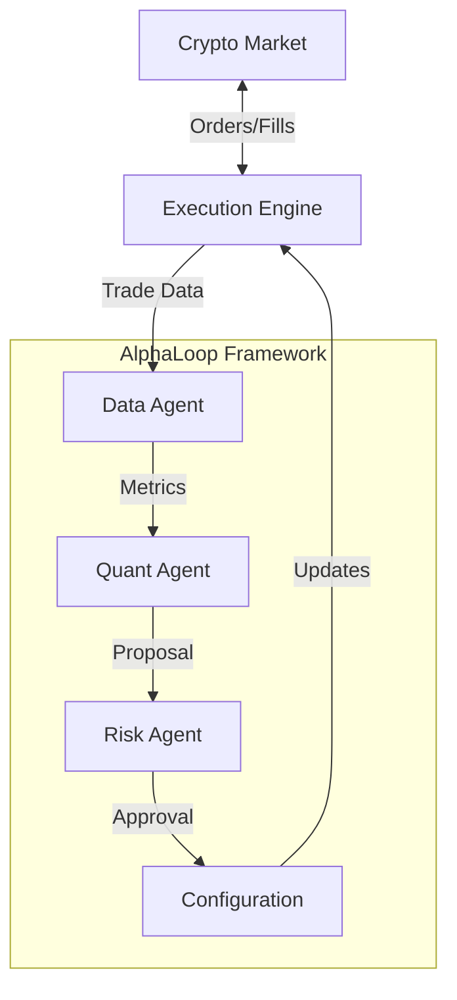

# MarketMakerDemo / 做市商演示


## 📄 Project Baseline

The project baseline overview is documented in [Project Baseline](docs/project_baseline.md).

## 🤖 Introduction / 简介
**MarketMakerDemo** is an autonomous, self-optimizing market making bot designed for crypto markets. Unlike traditional bots with static logic, this system continuously analyzes its own performance and adapts its strategy in real-time.
**MarketMakerDemo** 是一个专为加密市场设计的自主、自我优化的做市商机器人。与具有静态逻辑的传统机器人不同，该系统持续分析自身性能并实时调整策略。

It is powered by **AlphaLoop**, an agentic framework where specialized AI agents (Quant, Risk, Operations) collaborate to manage the trading business.
它由 **AlphaLoop** 驱动，这是一个智能体框架，专门的 AI 智能体（量化、风控、运营）在此协作管理交易业务。

> **Code Location / 代码位置**: The `AlphaLoop` class is implemented in [`src/trading/engine.py`](src/trading/engine.py).
> **代码位置**：`AlphaLoop` 类实现在 [`src/trading/engine.py`](src/trading/engine.py) 中。

### 🏛️ Project Organization / 项目组织

This project follows an **Agent-First Architecture** with a **9-Agent system** organized into three layers:
本项目遵循**智能体优先架构**，采用**9-Agent 体系**，分为三层：

**Management Layer / 管理层**
- **Agent PM** - Project management, progress tracking, coordination
- **Agent PO** - Product owner, requirements, specifications, user stories
- **Agent ARCH** - System architect, interface contracts, shared platform

**Development Layer / 开发层**
- **Agent TRADING** - Trading engine, exchange connectivity, order management
- **Agent PORTFOLIO** - Portfolio management, risk indicators, capital allocation
- **Agent WEB** - Web API, FastAPI services, user interface
- **Agent AI** - LLM integration, AI agents, evaluation framework

**Quality Layer / 质量层**
- **Agent QA** - Quality assurance, testing, documentation
- **Agent REVIEW** - Code review, quality checks, security

See [Agent Documentation](docs/agents/README.md) for details.
详见 [Agent 文档](docs/agents/README.md)。

### 📦 Module Structure / 模块结构

The project is organized into **6 core modules**:
项目组织为**6 个核心模块**：

| Module | Owner | Purpose |
|--------|-------|---------|
| **shared** | Agent ARCH | Common utilities (config, logging, metrics) |
| **trading** | Agent TRADING | Exchange connection, orders, strategies |
| **portfolio** | Agent PORTFOLIO | Capital allocation, risk management |
| **ai** | Agent AI | LLM evaluation, strategy optimization |
| **web** | Agent WEB | REST API, user interface |
| **qa** | Agent QA | Testing, documentation |

See [Modules Overview](docs/modules_overview.md) for detailed information.
详见 [模块概览](docs/modules_overview.md)。

---

## 🧠 Powered by AlphaLoop / 由 AlphaLoop 驱动
This bot is not just a script; it's a digital organization.
这个机器人不仅仅是一个脚本；它是一个数字组织。

**Implementation / 实现位置**: The `AlphaLoop` class is defined in [`src/trading/engine.py`](src/trading/engine.py). It orchestrates multiple strategy instances and coordinates AI agents (Data, Quant, Risk) to manage the trading business.
**实现位置**：`AlphaLoop` 类定义在 [`src/trading/engine.py`](src/trading/engine.py) 中。它协调多个策略实例并协调 AI 智能体（数据、量化、风控）来管理交易业务。

### The Core Loop / 核心循环
1.  **Trade**: The bot executes a `FixedSpreadStrategy`.
2.  **Analyze**: The **Quant Agent** reviews performance metrics (Sharpe Ratio, Win Rate).
3.  **Propose**: If performance is suboptimal, the Quant proposes changes (e.g., "Widen spread to 0.3%").
4.  **Validate**: The **Risk Agent** checks the proposal against strict safety limits.
5.  **Optimize**: If approved, the system updates its configuration instantly.

## 🗂 Governance Map / 治理地图

- `project_manifest.json` – Global map for modules, owners, directories, and dependencies / 用于记录模块、负责人、目录与依赖的全局地图。
- `docs/modules/{module}.json` – Module card with responsibilities, constraints, and embedded feature list (Spec/Story/Test/CI) / 模块卡片，包含职责、约束及内嵌的 Feature（含 Spec/Story/Test/CI）。
- `docs/progress/progress_index.json` – Read-only event log tying feature IDs to branches、PR 与 CI 结果 / 只读事件日志，把 Feature ID 与分支、PR、CI 结果串联起来。
- `scripts/audit_check.py` – Lightweight audit validating manifest, module cards, progress index, and artifact files / 轻量审计脚本，校验 manifest、模块卡片、进度索引及实物文件。
- `scripts/advance_feature.py` – **Automated feature advancement** / **自动化 Feature 推进**：一键更新模块 JSON、同步 roadmap、添加进度事件并运行审计检查。详见 [Feature Automation Guide](docs/development_protocol_feature_automation.md)。

> **Workflow Tip / 流程提示**：
> - **推荐**：使用 `python scripts/advance_feature.py <feature_id> <new_step>` 自动推进 Feature
> - **手动流程**：新增 Feature 前先更新模块 JSON；开发完成后在 progress index 追加事件，并运行 `python scripts/audit_check.py` 确认闭环

---

## 📚 Documentation Reading Guide / 文档阅读指南

This project has comprehensive documentation. **If you are new to the system**, follow this reading order:
本项目有完整的文档。**如果您是新手**，请按以下顺序阅读：

### 🎯 For First-Time Readers / 初次阅读者

**Start Here:**
1. **[Quick Start Guide](docs/quick_start.md)** ⭐ **NEW TEAM MEMBERS START HERE**
   - 5-minute overview of the project
   - Module structure, workflow, and key concepts
   - **新团队成员从这里开始** - 5 分钟项目概览

2. **[System Flow](docs/system_flow.md)** ⭐ **UNDERSTAND THE SYSTEM**
   - Understand what happens when you click "Start Bot"
   - See the complete interaction flow with diagrams
   - **理解系统** - 了解点击"启动 Bot"后发生的事情

3. **[Walkthrough](docs/walkthrough.md)**
   - See the system in action with real examples
   - Verification results and proof of work
   - 查看系统运行的实际示例

4. **[Architecture](docs/architecture.md)**
   - High-level system design
   - Component relationships and data flow
   - 高层系统设计和组件关系

### 🔧 For Developers / 开发者

**After understanding the basics, dive deeper:**

4. **[Development Workflow](docs/development_workflow.md)** ⭐ **NEW DEVELOPERS START HERE**
   - Complete 13-step development pipeline guide
   - Step-by-step instructions with examples
   - Automation tools and best practices
   - **新开发者从这里开始** - 完整的 13 步开发流程指南

5. **[Modules Overview](docs/modules_overview.md)** ⭐ **UNDERSTAND THE CODEBASE**
   - Clear explanation of all 6 modules
   - Module responsibilities, dependencies, and ownership
   - Directory structure and interaction examples
   - **理解代码库** - 清晰解释所有 6 个模块

7. **[Trading Strategy](docs/trading_strategy.md)**
   - How the market-making strategy works
   - Spread calculation and order placement logic
   - 做市策略的工作原理

8. **[Implementation Plan](docs/implementation_plan.md)**
   - Recent changes and planned features
   - Technical details of implementations
   - 最近的更改和计划功能

9. **[Development Protocol](docs/development_protocol.md)**
   - Mandatory development standards
   - Testing requirements and coverage goals
   - 强制性开发标准和测试要求

10. **[Feature Automation Guide](docs/development_protocol_feature_automation.md)** 🆕
    - Automated feature advancement scripts
    - Batch operations and Git hooks
    - 自动化功能推进脚本
    - 批量操作和 Git 钩子

11. **[CI/CD Process](docs/cicd.md)** 🆕
    - Automated testing and deployment pipeline
    - Quality gates and pre-commit checklist
    - 自动化测试和部署流程

12. **[Dashboard Guide](docs/dashboard.md)** 🆕
    - Monitoring metrics and charts
    - Professional definitions of KPIs
    - 监控指标和图表
    - KPI 的专业定义

13. **[API Reference Documentation](docs/api_reference.md)** 🆕
    - Auto-generated API docs (pdoc)
    - Interactive API documentation (FastAPI)
    - 自动生成的 API 文档
    - 交互式 API 文档

14. **[Strategy Development Guide](docs/strategy_development_guide.md)** 🆕
    - Step-by-step guide for adding new trading strategies
    - Integration requirements and best practices
    - 添加新交易策略的分步指南
    - 集成要求和最佳实践

15. **[Multi-LLM Evaluation Guide](docs/user_guide/multi_llm_evaluation.md)** 🆕
    - Compare strategies from Gemini, OpenAI, and Claude
    - Simulation-based strategy validation
    - 多模型策略评估与比较
    - 基于模拟的策略验证

16. **[Risk Indicators Guide](docs/user_guide/risk_indicators.md)** 🆕
    - Liquidation Buffer, Inventory Drift, Max Drawdown
    - Real-time risk monitoring
    - 强平缓冲、库存偏移、最大回撤
    - 实时风险监控

17. **[Error Handling Guide](docs/user_guide/error_handling.md)** 🆕
   - Comprehensive error handling and recovery
   - Multi-strategy error isolation
   - Troubleshooting common issues
   - 全面的错误处理和恢复机制
   - 多策略错误隔离
   - 常见问题故障排除

18. **AlphaLoop Framework Documentation** (docs/framework/)
   - **[Framework Design](docs/framework/framework_design.md)**: The "Agent-First" architecture
     - 框架设计 - "智能体优先"架构
   - **[Agent Roles and Hierarchy](docs/framework/agent_roles_and_hierarchy.md)**: Meet the AI agents
     - 智能体角色和层级 - 了解各个 AI 智能体
   - **[Agent Workflows](docs/framework/agent_workflows.md)**: How agents collaborate
     - 智能体工作流 - 智能体如何协作
   - **[Metrics Specification](docs/framework/metrics_specification.md)**: KPIs we track
     - 指标规范 - 我们跟踪的 KPI
   - **[Evaluation Framework](docs/framework/evaluation_framework.md)**: Testing and validation
     - 评估框架 - 测试和验证

19. **[Agent Documentation](docs/agents/README.md)** 🆕
   - Complete guide to the 9-Agent system
   - Agent responsibilities and ownership
   - Multi-agent development workflow
   - 9-Agent 体系完整指南
   - Agent 职责和所有权
   - 多 Agent 开发工作流

### 📊 Quick Reference / 快速参考

- **Project Review** ([project_review.md](docs/project_review.md)): Status updates and progress tracking
- **Task List** ([task.md](docs/task.md)): Current development tasks

---

## 🚀 Quick Start / 快速开始

### Prerequisites / 先决条件
*   Python 3.11+
*   Virtual environment (recommended)
*   `pip install -r requirements.txt`

### Project Structure / 项目结构
```
MarketMakerDemo/
├── src/                    # Source code (organized by module)
│   ├── shared/            # Shared platform (Agent ARCH)
│   ├── trading/           # Trading engine (Agent TRADING)
│   ├── portfolio/         # Portfolio & risk (Agent PORTFOLIO)
│   ├── ai/                # AI & evaluation (Agent AI)
│   └── web/               # Web & API (Agent WEB)
├── tests/                 # Tests (organized by type)
│   ├── unit/             # Unit tests (by module)
│   ├── smoke/             # Smoke tests (Agent QA)
│   └── integration/       # Integration tests (Agent QA)
├── docs/                  # Documentation
│   ├── agents/            # Agent documentation
│   ├── modules/           # Module cards (JSON)
│   ├── specs/             # Specifications (Agent PO)
│   ├── stories/           # User stories (Agent PO)
│   └── user_guide/        # User documentation (Agent QA)
├── contracts/             # Interface contracts (Agent ARCH)
├── status/                # Roadmap & progress tracking (Agent PM)
└── scripts/               # Automation scripts
```

### Running the Bot / 运行机器人

**Option 1: Command Line / 命令行**
```bash
# Launch the autonomous market maker
python3 run.py
```

**Option 2: Web Interface / Web 界面**
```bash
# Start the FastAPI server
python3 server.py

# Then open in browser:
# - Main dashboard: http://localhost:3000/
# - LLM Trade Lab: http://localhost:3000/evaluation
```

### What to Watch / 观察内容
Check the logs to see the agents in action:
1.  **QuantAgent**: "Win rate is low (42%), I propose widening the spread to 0.25%."
2.  **RiskAgent**: "Validating proposal... Spread is within limits (Max 5%). APPROVED."
3.  **System**: "Applying new configuration. Spread updated to 0.25%."

---

## 🏗️ Architecture / 架构

### System Architecture / 系统架构



### Module Dependencies / 模块依赖

```
shared (base)
  ↑
  ├── trading
  │     ↑
  │     ├── portfolio
  │     └── ai
  │           ↑
  │           └── web
```

### Development Pipeline / 开发流程

Every feature follows a **13-step pipeline**:
每个功能都遵循**13 步流程**：

```
Spec → Story → AC → Contract → Test → Code → Review → Unit → Smoke → Integration → Docs → Progress → CI/CD
```

See [Development Workflow](docs/development_workflow.md) for complete details.
详见 [开发流程](docs/development_workflow.md) 了解完整详情。
