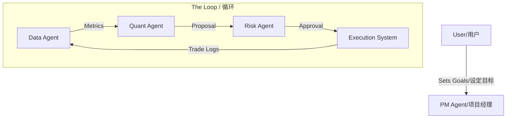

# AlphaLoop: Agentic Trading Framework / 智能体交易框架

## 👋 Welcome / 欢迎
Welcome to **AlphaLoop**. If you are new here, think of this project not just as a piece of software, but as a **digital hedge fund** where every employee is an AI Agent.
欢迎来到 **AlphaLoop**。如果您是初学者，请不要仅仅将本项目视为软件，而应将其视为一个**数字对冲基金**，其中的每位员工都是一个 AI 智能体。

---

## 🗺️ Navigation Map / 导航地图
To understand this project, follow this path:
要理解本项目，请遵循以下路径：

### 1. The Concept (概念)
*   **[Framework Design / 框架设计](docs/alphaloop/framework_design.md)**
    *   *What is this?* A high-level overview of the "Agent-First" philosophy.
    *   *Analogy*: The "Brain" of the organization.
    *   *内容*：“智能体优先”理念的高层概述。
    *   *类比*：组织的“大脑”。

### 2. The Team (团队)
*   **[Agent Roles & Hierarchy / 智能体角色与层级](docs/alphaloop/agent_roles_and_hierarchy.md)**
    *   *Who works here?* Meet the Quant, the Risk Manager, the Trader, and the Engineer.
    *   *Analogy*: The "Org Chart".
    *   *内容*：认识量化、风控、交易员和工程师。
    *   *类比*：“组织架构图”。

### 3. The Process (流程)
*   **[Agent Workflows / 智能体工作流](docs/alphaloop/agent_workflows.md)**
    *   *How do they work together?* See how a strategy goes from an idea to production.
    *   *Analogy*: The "Standard Operating Procedures (SOPs)".
    *   *内容*：查看策略如何从想法变为生产。
    *   *类比*：“标准作业程序 (SOP)”。

### 4. The Scoreboard (计分板)
*   **[Metrics Specification / 度量指标规范](docs/alphaloop/metrics_specification.md)**
    *   *How do we measure success?* The specific numbers we track (Sharpe, Slippage, Latency).
    *   *Analogy*: The "KPI Dashboard".
    *   *内容*：我们追踪的具体数字（夏普比率、滑点、延迟）。
    *   *类比*：“KPI 仪表板”。

### 5. The Evaluation (评估)
*   **[Evaluation Framework / 评估框架](docs/alphaloop/evaluation_framework.md)**
    *   *How do we grade the system?* A 4-layer deep dive into system health.
    *   *Analogy*: The "Quarterly Review".
    *   *内容*：深入系统健康的 4 层评估。
    *   *类比*：“季度审查”。

---

## 🚀 Quick Start / 快速开始

### Prerequisites / 先决条件
*   Python 3.9+
*   `pip install -r requirements.txt`

### Running the Simulation / 运行模拟
The core of this project is the `AlphaLoop`, a continuous cycle of trading, analysis, and optimization.
本项目核心是 `AlphaLoop`，一个交易、分析和优化的连续循环。

```bash
# Run the autonomous loop
python3 agent_framework.py
```

### What to Watch / 观察内容
Check the logs to see the agents talking to each other:
检查日志以查看智能体之间的对话：
1.  **QuantAgent**: "Win rate is low, I propose widening the spread." (胜率低，我建议扩大价差。)
2.  **RiskAgent**: "Checking... Approved." (检查中... 批准。)
3.  **DataAgent**: "Calculated Sharpe Ratio: 1.5." (计算出的夏普比率：1.5。)

---

## 🏗️ Architecture / 架构


