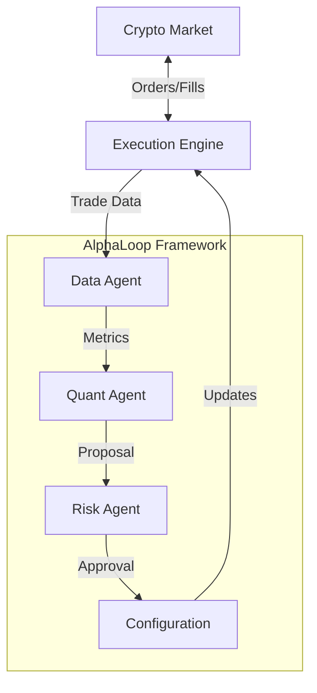

# MarketMakerDemo / 做市商演示

## 🤖 Introduction / 简介
**MarketMakerDemo** is an autonomous, self-optimizing market making bot designed for crypto markets. Unlike traditional bots with static logic, this system continuously analyzes its own performance and adapts its strategy in real-time.
**MarketMakerDemo** 是一个专为加密市场设计的自主、自我优化的做市商机器人。与具有静态逻辑的传统机器人不同，该系统持续分析自身性能并实时调整策略。

It is powered by **AlphaLoop**, an agentic framework where specialized AI agents (Quant, Risk, Operations) collaborate to manage the trading business.
它由 **AlphaLoop** 驱动，这是一个智能体框架，专门的 AI 智能体（量化、风控、运营）在此协作管理交易业务。

---

## 🧠 Powered by AlphaLoop / 由 AlphaLoop 驱动
This bot is not just a script; it's a digital organization.
这个机器人不仅仅是一个脚本；它是一个数字组织。

### The Core Loop / 核心循环
1.  **Trade**: The bot executes a `FixedSpreadStrategy`.
2.  **Analyze**: The **Quant Agent** reviews performance metrics (Sharpe Ratio, Win Rate).
3.  **Propose**: If performance is suboptimal, the Quant proposes changes (e.g., "Widen spread to 0.3%").
4.  **Validate**: The **Risk Agent** checks the proposal against strict safety limits.
5.  **Optimize**: If approved, the system updates its configuration instantly.

---

## 🗺️ Documentation / 文档
Explore the internal workings of the bot and its framework:
探索机器人及其框架的内部工作原理：

### 1. The Framework (框架)
*   **[Framework Design / 框架设计](docs/alphaloop/framework_design.md)**: The "Agent-First" architecture behind the bot.

### 2. The Team (团队)
*   **[Agent Roles / 智能体角色](docs/alphaloop/agent_roles_and_hierarchy.md)**: Meet the AI agents managing your money.

### 3. The Process (流程)
*   **[Workflows / 工作流](docs/alphaloop/agent_workflows.md)**: How agents collaborate to optimize strategies.

### 4. Metrics (指标)
*   **[Metrics Specification / 指标规范](docs/alphaloop/metrics_specification.md)**: The KPIs we track (Slippage, Latency, Sharpe).

---

## 🚀 Quick Start / 快速开始

### Prerequisites / 先决条件
*   Python 3.9+
*   `pip install -r requirements.txt`

### Running the Bot / 运行机器人
```bash
# Launch the autonomous market maker
python3 run.py
```

### What to Watch / 观察内容
Check the logs to see the agents in action:
1.  **QuantAgent**: "Win rate is low (42%), I propose widening the spread to 0.25%."
2.  **RiskAgent**: "Validating proposal... Spread is within limits (Max 5%). APPROVED."
3.  **System**: "Applying new configuration. Spread updated to 0.25%."

---

## 🏗️ Architecture / 架构


