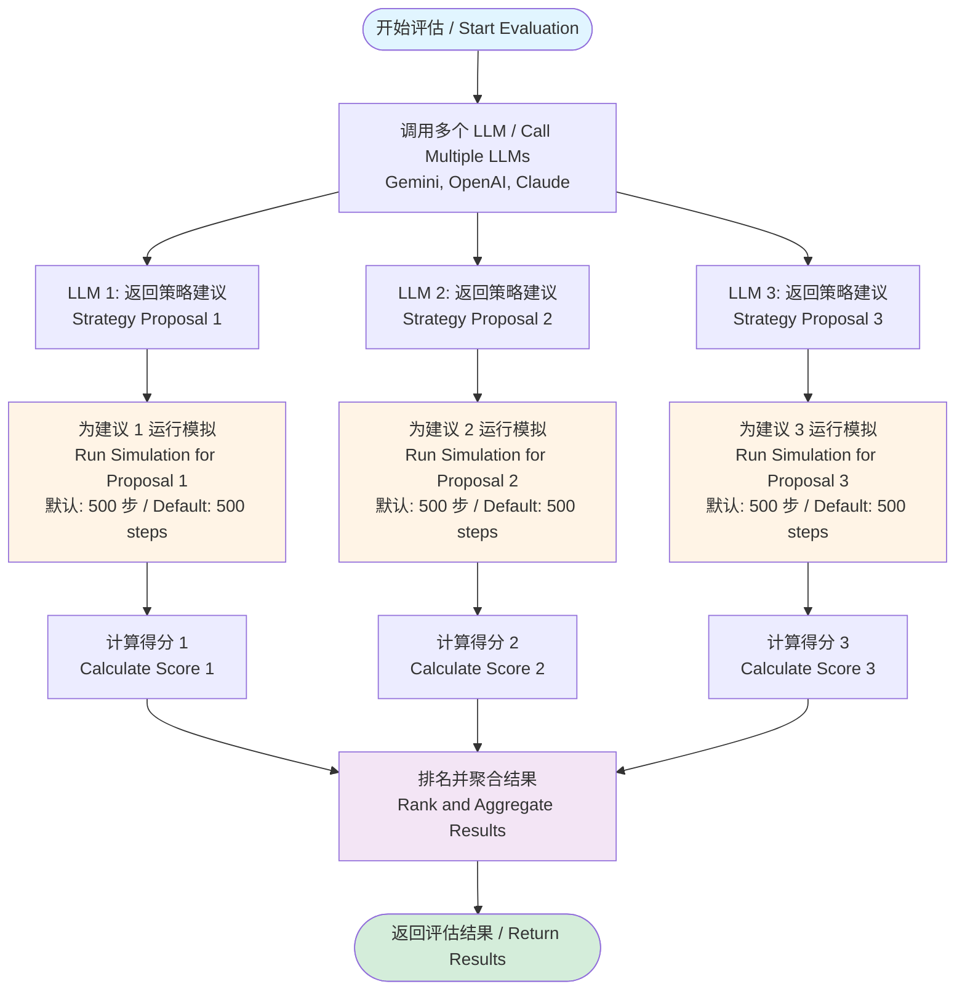
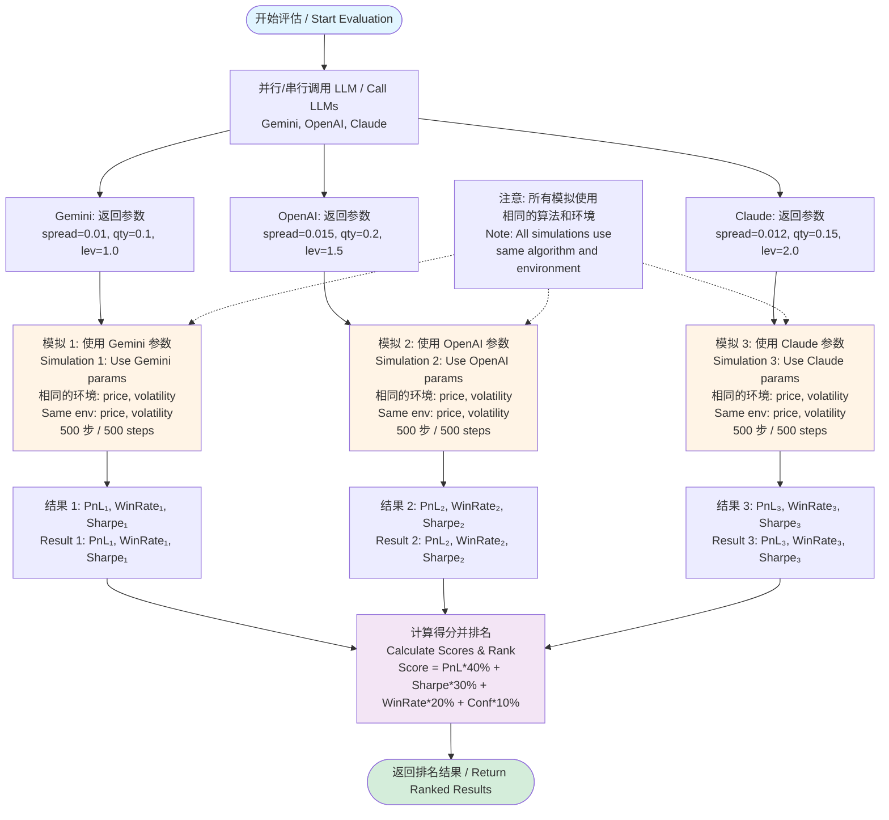

# LLM Evaluation Algorithm Explanation / LLM 评估算法说明

## 1. Score Algorithm / 评分算法

### Current Formula / 当前公式
```
Score = PnL×40% + Sharpe×30% + WinRate×20% + Confidence×10%
```

### Algorithm Source / 算法来源
**Location**: `alphaloop/evaluation/evaluator.py::_score_and_rank()`

The scoring algorithm is a **weighted composite score** designed to balance multiple performance dimensions:

1. **PnL (40%)** - Primary performance metric, normalized to 0-100 scale
   - Formula: `min(max(realized_pnl / 100.0, -1), 1) * 50 + 50`
   - Rationale: Direct measure of profitability

2. **Sharpe Ratio (30%)** - Risk-adjusted returns
   - Formula: `min(max(sharpe_ratio / 3.0, -1), 1) * 50 + 50`
   - Rationale: Accounts for risk, not just returns

3. **Win Rate (20%)** - Consistency metric
   - Formula: `win_rate * 100`
   - Rationale: Measures strategy reliability

4. **Confidence (10%)** - LLM's self-assessment
   - Formula: `confidence * 100`
   - Rationale: Incorporates LLM's own uncertainty

### Confidence Business Meaning / Confidence 业务意义

**What is Confidence?**
- Confidence is the **LLM's self-reported certainty** in its recommendation (0.0 to 1.0)
- It comes from the LLM's JSON response: `{"confidence": 0.85, ...}`
- The LLM is explicitly asked in the prompt: "Your confidence level in this recommendation"

**Business Interpretation / 业务解释**:
- **High confidence (0.8-1.0)**: LLM believes market conditions strongly support this strategy
- **Medium confidence (0.5-0.8)**: LLM sees mixed signals or moderate certainty
- **Low confidence (0.0-0.5)**: LLM is uncertain, market may be unclear or volatile

**Why Include in Score?**
- LLMs can express uncertainty when market data is ambiguous
- Low confidence may indicate the strategy needs more validation
- However, confidence is weighted only 10% because:
  - LLM confidence is subjective and may not always correlate with actual performance
  - Real performance (PnL, Sharpe) should dominate the score

**Source / 来源**:
- Prompt: `alphaloop/evaluation/prompts.py::StrategyAdvisorPrompt`
- LLM Output: JSON field `"confidence": 0.0 to 1.0`
- Usage: `alphaloop/evaluation/evaluator.py::_score_and_rank()` line 352

---

## 2. Parameter Aggregation Issue / 参数聚合问题

### Current Problem / 当前问题

**Current Implementation** (Line 762-765 in `evaluator.py`):
```python
spread=parameter_stats.spread_median,
skew_factor=parameter_stats.skew_median,
quantity=parameter_stats.quantity_median,
leverage=parameter_stats.leverage_median,
```

**Issue**: Taking median of each parameter **independently** breaks parameter coherence.

**Example Problem**:
- Model A: `{spread: 0.01, quantity: 0.1, leverage: 2}` → Score: 85
- Model B: `{spread: 0.02, quantity: 0.2, leverage: 3}` → Score: 90
- Model C: `{spread: 0.015, quantity: 0.15, leverage: 2.5}` → Score: 80

**Current (Wrong) Approach**:
- Consensus: `{spread: 0.015, quantity: 0.15, leverage: 2.5}` (medians)
- This creates a **parameter set that was never tested** in simulation!

**Correct Approach**:
- Should select the **complete parameter set** from the best-performing model
- Or use **weighted average** of complete sets based on scores
- Parameters are **atomic units** - they work together as a system

### Proposed Fix / 建议修复

**Option 1: Best Model Approach (Recommended)**
- Select the complete parameter set from the highest-scoring model among agreeing models
- Ensures we use a tested, coherent parameter combination

**Option 2: Score-Weighted Average**
- Weight each complete parameter set by its simulation score
- More sophisticated but requires careful validation

**Option 3: Clustering Approach**
- Group similar parameter sets, select from best cluster
- Most robust but computationally expensive

---

## 3. Simulation Process / 模拟过程

### How Simulation Works / 模拟如何工作

**Location**: `alphaloop/evaluation/evaluator.py::StrategySimulator`

### Simulation Flow Diagram / 模拟流程图

以下流程图展示了完整的评估和模拟过程：



**模拟运行次数说明 / Simulation Run Count**:
- **每个 LLM 建议运行 1 次模拟** / Each LLM proposal runs 1 simulation
- **默认每次模拟运行 500 步** / Default: 500 steps per simulation
- **如果有 N 个 LLM，总共运行 N 次模拟** / With N LLMs, total N simulations run
- **示例**: 3 个 LLM × 500 步/模拟 = 1500 步总模拟 / Example: 3 LLMs × 500 steps/sim = 1500 total steps

### Detailed Simulation Loop Flow / 详细模拟循环流程图

以下流程图展示了单次模拟的内部循环过程（500 步）：

```mermaid
flowchart TD
    Start([开始模拟 / Start Simulation<br/>初始化: 价格、波动率、策略参数<br/>Initialize: price, volatility, strategy params]) --> LoopStart{循环开始<br/>Loop Start<br/>i = 1 to 500}
    
    LoopStart -->|i <= 500| GenMarket["生成市场数据 / Generate Market Data<br/>1. 随机游走: price += gauss(0, price * volatility)<br/>2. 计算价差: spread = price * 0.0002<br/>3. 计算买卖价: bid = price - spread/2, ask = price + spread/2"]
    
    GenMarket --> CalcOrders[计算目标订单 / Calculate Target Orders<br/>使用 FixedSpread 策略<br/>Use FixedSpread Strategy<br/>参数: spread, quantity, leverage]
    
    CalcOrders --> CheckBuy{检查买单<br/>Check Buy Order<br/>order_price >= best_bid?}
    CheckBuy -->|是 / Yes| FillBuy[成交买单 / Fill Buy Order<br/>position += quantity<br/>更新持仓 / Update Position]
    CheckBuy -->|否 / No| CheckSell
    
    FillBuy --> CheckSell{检查卖单<br/>Check Sell Order<br/>order_price <= best_ask?}
    
    CheckSell -->|是 / Yes| FillSell[成交卖单 / Fill Sell Order<br/>position -= quantity<br/>更新持仓 / Update Position]
    CheckSell --> CalcPnL[计算已实现盈亏 / Calculate Realized PnL<br/>当持仓减少时计算<br/>Calculate when position decreases]
    
    CheckSell -->|否 / No| CalcPnL
    
    CalcPnL --> UpdateStats[更新统计 / Update Statistics<br/>- 总交易数 / Total trades<br/>- 盈利交易数 / Winning trades<br/>- PnL 历史 / PnL history]
    
    UpdateStats --> LoopEnd{i++}
    LoopEnd --> LoopStart
    
    LoopStart -->|i > 500| CalcMetrics[计算最终指标 / Calculate Final Metrics<br/>- Realized PnL<br/>- Win Rate = winning_trades / total_trades<br/>- Sharpe Ratio = mean(returns) / std(returns)]
    
    CalcMetrics --> End([返回模拟结果 / Return Simulation Result])
    
    style Start fill:#e1f5ff
    style End fill:#d4edda
    style GenMarket fill:#fff4e6
    style CalcOrders fill:#e8f5e9
    style FillBuy fill:#c8e6c9
    style FillSell fill:#c8e6c9
    style CalcMetrics fill:#f3e5f5
```

**模拟步数说明 / Simulation Steps Explanation**:
- **默认步数**: 500 步（可在 `MultiLLMEvaluator` 初始化时配置）
- **Default steps**: 500 (configurable in `MultiLLMEvaluator` initialization)
- **每步代表**: 一个市场数据更新周期（可理解为一次 tick 或一次订单簿更新）
- **Each step represents**: One market data update cycle (can be understood as one tick or one order book update)
- **总模拟时间**: 500 步 × 每个 LLM 建议 = 每个建议独立运行 500 步
- **Total simulation time**: 500 steps × each LLM proposal = each proposal runs 500 steps independently

### Step-by-Step Process / 逐步过程

1. **Initialize Simulator / 初始化模拟器** (Line 275-280)
   ```python
   simulator = StrategySimulator(
       strategy=strategy,  # FixedSpread strategy only / 仅使用 FixedSpread 策略
       initial_price=context.mid_price,  # 初始价格
       volatility=context.volatility_1h,  # 1小时波动率
   )
   ```
   - **初始化内容**：
     - 创建 FixedSpread 策略实例，应用 LLM 建议的参数（价差、数量、杠杆等）
     - 设置初始价格（市场中间价）
     - 设置波动率（用于生成价格随机游走）
     - **注意**: 模拟中仅支持 FixedSpread 策略，不支持 FundingRate 策略

2. **Run Simulation Loop / 运行模拟循环** (Line 915-948)
   - **For each step / 每一步** (默认: 500 步):
     a. **Generate Market Data / 生成市场数据** (Line 892-913)
        - **随机游走模型**: `price_change = gauss(0, price * volatility)`
          - 使用高斯分布生成价格变化
          - 均值 = 0（无趋势）
          - 标准差 = `price * volatility`（波动率越大，价格波动越大）
        - **市场价差**: 中间价 ± 2 bps（基点）
          - `best_bid = mid_price - spread / 2`
          - `best_ask = mid_price + spread / 2`
        - **价格边界**: 确保价格始终为正（`max(price, 1.0)`）
        - **模拟真实市场**: 模拟订单簿的买卖价差和价格波动
     
     b. **Calculate Target Orders / 计算目标订单** (Line 921-933)
        - **策略计算**: 根据当前市场数据计算买卖订单
        - **使用 LLM 参数**: 
          - `spread`: 做市价差（固定价差）
          - `quantity`: 订单数量
          - `leverage`: 杠杆倍数
        - **订单类型**: 
          - FixedSpread 策略：固定价差订单
          - **注意**: 模拟中仅支持 FixedSpread 策略，`skew_factor` 参数在模拟中不使用
     
     c. **Simulate Order Fills / 模拟订单成交** (Line 936-948)
        - **买单成交条件**: `order_price >= market_best_bid`
          - 当我们的买价 >= 市场最佳买价时，订单成交
        - **卖单成交条件**: `order_price <= market_best_ask`
          - 当我们的卖价 <= 市场最佳卖价时，订单成交
        - **持仓更新**: 
          - 买单成交：`position += quantity`（增加多头持仓）
          - 卖单成交：`position -= quantity`（减少多头持仓或增加空头持仓）
        - **PnL 计算**: 当持仓减少时，计算已实现盈亏

3. **Calculate Metrics / 计算指标** (Line 284-292)
   - **Realized PnL / 已实现盈亏**: 所有已平仓交易的累计盈亏
   - **Win Rate / 胜率**: 盈利交易数 / 总交易数 × 100%
   - **Sharpe Ratio / 夏普比率**: 风险调整后的收益指标
     - 公式: `(平均收益 - 无风险利率) / 收益标准差`
   - **Total Trades / 总交易数**: 已执行的交易数量

### LLM-Specific Simulation Processing / 不同 LLM 的模拟处理

**重要说明 / Important Note**: 虽然不同 LLM（Gemini, OpenAI, Claude）可能返回不同的策略参数建议，但它们在模拟处理上**使用完全相同的模拟流程和算法**。

**Important Note**: Although different LLMs (Gemini, OpenAI, Claude) may return different strategy parameter recommendations, they all use **exactly the same simulation process and algorithm**.

#### 相同点 / Similarities

1. **相同的模拟流程 / Same Simulation Process**:
   - 所有 LLM 的建议都经过 `_run_simulation()` 方法处理
   - All LLM proposals go through the same `_run_simulation()` method
   - 使用相同的 `StrategySimulator` 类
   - Uses the same `StrategySimulator` class

2. **相同的模拟环境 / Same Simulation Environment**:
   - **相同的市场上下文**: 所有 LLM 使用相同的 `MarketContext`
   - **Same market context**: All LLMs use the same `MarketContext`
   - **相同的初始价格**: `initial_price = context.mid_price`
   - **Same initial price**: `initial_price = context.mid_price`
   - **相同的波动率**: `volatility = context.volatility_1h`
   - **Same volatility**: `volatility = context.volatility_1h`
   - **相同的模拟步数**: 默认 500 步（所有 LLM 相同）
   - **Same simulation steps**: Default 500 steps (same for all LLMs)

3. **相同的模拟算法 / Same Simulation Algorithm**:
   - 相同的随机游走模型: `price_change = gauss(0, price * volatility)`
   - Same random walk model: `price_change = gauss(0, price * volatility)`
   - 相同的市场价差计算: `spread = price * 0.0002` (2 bps)
   - Same market spread calculation: `spread = price * 0.0002` (2 bps)
   - 相同的订单成交逻辑: 价格穿越时成交
   - Same order fill logic: Fill when price crosses
   - 相同的性能指标计算: PnL, Win Rate, Sharpe Ratio
   - Same performance metrics calculation: PnL, Win Rate, Sharpe Ratio

4. **相同的策略类型 / Same Strategy Type**:
   - 所有 LLM 的建议都转换为 `FixedSpreadStrategy` 进行模拟
   - All LLM proposals are converted to `FixedSpreadStrategy` for simulation
   - 即使 LLM 建议其他策略类型，模拟中也只使用 FixedSpread
   - Even if LLM suggests other strategy types, only FixedSpread is used in simulation

#### 不同点 / Differences

1. **不同的策略参数 / Different Strategy Parameters**:
   ```python
   # 不同 LLM 可能返回不同的参数
   # Different LLMs may return different parameters
   
   Gemini 建议:  spread=0.01, quantity=0.1, leverage=1.0
   OpenAI 建议: spread=0.015, quantity=0.2, leverage=1.5
   Claude 建议:  spread=0.012, quantity=0.15, leverage=2.0
   ```
   - 这些参数会被应用到 `FixedSpreadStrategy` 实例
   - These parameters are applied to `FixedSpreadStrategy` instances
   - 导致不同的订单价格和数量
   - Results in different order prices and quantities

2. **不同的模拟结果 / Different Simulation Results**:
   由于参数不同，每个 LLM 的模拟结果会不同：
   Due to different parameters, each LLM's simulation results differ:
   - **不同的 PnL**: 不同价差和数量导致不同的盈亏
   - **Different PnL**: Different spreads and quantities lead to different profits/losses
   - **不同的胜率**: 不同参数导致不同的交易成功率
   - **Different win rate**: Different parameters lead to different trade success rates
   - **不同的夏普比率**: 不同的收益波动比
   - **Different Sharpe ratio**: Different return-to-volatility ratios

3. **不同的 LLM 调用延迟 / Different LLM Call Latency**:
   - 每个 LLM 的 API 调用时间不同（Gemini, OpenAI, Claude 的响应时间不同）
   - Each LLM's API call time differs (Gemini, OpenAI, Claude have different response times)
   - 这影响 `latency_ms` 指标，但不影响模拟本身
   - This affects the `latency_ms` metric but does not affect simulation itself

4. **不同的解析成功率 / Different Parse Success Rates**:
   - 不同 LLM 的 JSON 格式可能略有不同
   - Different LLMs may have slightly different JSON formats
   - 解析失败时，会使用默认参数（spread=0.01）运行模拟
   - On parse failure, default parameters (spread=0.01) are used for simulation

#### 模拟处理流程图 / Simulation Processing Flow Diagram



#### 关键要点 / Key Points

1. **公平比较 / Fair Comparison**:
   - 所有 LLM 在**完全相同的市场环境**下运行模拟
   - All LLMs run simulations in **exactly the same market environment**
   - 这确保了比较的公平性，差异仅来自 LLM 的参数建议
   - This ensures fair comparison, differences only come from LLM parameter recommendations

2. **参数是唯一变量 / Parameters Are the Only Variable**:
   - 模拟算法、环境、步数都相同
   - Simulation algorithm, environment, and steps are all the same
   - 只有 `spread`, `quantity`, `leverage` 参数不同
   - Only `spread`, `quantity`, `leverage` parameters differ

3. **结果差异的来源 / Source of Result Differences**:
   - 结果差异完全来自 LLM 建议的参数不同
   - Result differences come entirely from different LLM-suggested parameters
   - 不是来自模拟算法或环境的差异
   - Not from differences in simulation algorithm or environment

4. **模拟的可重现性 / Simulation Reproducibility**:
   - 如果使用相同的参数，模拟结果应该相同（假设随机种子相同）
   - With same parameters, simulation results should be identical (assuming same random seed)
   - 不同 LLM 的结果不同是因为参数不同，而非模拟算法不同
   - Different LLM results differ due to different parameters, not different algorithms

### Simulation Execution Count / 模拟执行次数

**关键指标 / Key Metrics**:

1. **每个 LLM 建议运行 1 次独立模拟** / Each LLM proposal runs 1 independent simulation
   - 如果 LLM 返回 3 个建议，则运行 3 次模拟
   - If LLM returns 3 proposals, 3 simulations run

2. **每次模拟默认运行 500 步** / Each simulation runs 500 steps by default
   - 可在 `MultiLLMEvaluator(simulation_steps=N)` 中配置
   - Configurable via `MultiLLMEvaluator(simulation_steps=N)`

3. **总模拟步数计算** / Total Simulation Steps Calculation:
   ```
   总步数 = LLM 数量 × 每个 LLM 的建议数 × 每次模拟的步数
   Total Steps = Number of LLMs × Proposals per LLM × Steps per Simulation
   
   示例 / Example:
   - 3 个 LLM (Gemini, OpenAI, Claude)
   - 每个 LLM 返回 1 个建议
   - 每次模拟 500 步
   - 总步数 = 3 × 1 × 500 = 1500 步
   ```

4. **模拟是并行还是串行** / Simulation Parallel vs Sequential:
   - **LLM 调用**: 默认并行（`parallel=True`）
   - **LLM calls**: Parallel by default (`parallel=True`)
   - **模拟执行**: 每个建议的模拟独立运行（可并行优化）
   - **Simulation execution**: Each proposal's simulation runs independently (can be parallelized)

5. **性能考虑** / Performance Considerations:
   - 500 步模拟通常需要 < 1 秒
   - 500-step simulation typically takes < 1 second
   - 3 个 LLM × 500 步 ≈ 3 秒总时间（包括 LLM API 调用时间）
   - 3 LLMs × 500 steps ≈ 3 seconds total (including LLM API call time)
   - LLM API 调用时间通常远大于模拟时间
   - LLM API call time usually much greater than simulation time

### Simulation Algorithm Details / 模拟算法细节

#### Market Data Generation / 市场数据生成算法 (Line 892-913)

**算法原理**:
```python
# 随机游走模型（几何布朗运动简化版）
# Random walk model (simplified geometric Brownian motion)
change = random.gauss(0, current_price * volatility)
current_price += change

# 市场价差（2 bps = 0.02%）
# Market spread (2 bps = 0.02%)
spread = current_price * 0.0002
best_bid = current_price - spread / 2
best_ask = current_price + spread / 2
```

**中文说明**:
1. **价格随机游走**:
   - 使用高斯分布（正态分布）生成价格变化
   - `gauss(0, σ)` 表示均值为 0、标准差为 σ 的正态分布
   - 标准差 = `current_price * volatility`，确保波动幅度与价格成正比
   - 价格变化: `ΔP ~ N(0, P × σ)`
   - 这模拟了市场的随机波动，符合有效市场假说

2. **市场价差**:
   - 价差 = 中间价 × 0.0002 = 2 bps（基点）
   - 买一价 = 中间价 - 价差/2
   - 卖一价 = 中间价 + 价差/2
   - 这模拟了真实交易所的订单簿价差

3. **价格边界保护**:
   - 确保价格始终为正: `price = max(price, 1.0)`
   - 防止价格跌至负数或零

#### Order Fill Logic / 订单成交逻辑 (Line 936-948)

**算法原理**:
```python
# 买单成交条件
if order["side"] == "buy" and order["price"] >= market_data["best_bid"]:
    position += order["quantity"]
    # 更新持仓和 PnL

# 卖单成交条件
elif order["side"] == "sell" and order["price"] <= market_data["best_ask"]:
    position -= order["quantity"]
    # 更新持仓和 PnL
```

**中文说明**:
1. **买单成交机制**:
   - 当我们的买价 >= 市场最佳买价时，订单成交
   - 这模拟了"价格穿越"场景：我们的订单价格足够高，能够匹配到卖单
   - 成交后，持仓增加（做多）

2. **卖单成交机制**:
   - 当我们的卖价 <= 市场最佳卖价时，订单成交
   - 这模拟了"价格穿越"场景：我们的订单价格足够低，能够匹配到买单
   - 成交后，持仓减少（平多）或增加空头持仓（做空）

3. **成交假设**:
   - **当前实现**: 假设 100% 成交（如果价格条件满足）
   - **现实情况**: 实际市场中可能存在部分成交、滑点、延迟等
   - **改进方向**: 见下方"潜在问题"部分

#### Performance Tracking / 性能跟踪机制 (Line 940-947)

**算法原理**:
使用 `PerformanceTracker` 类（`alphaloop/market/performance.py`）跟踪：

1. **已实现盈亏 (Realized PnL)**:
   ```python
   # 当持仓减少时（平仓），计算已实现盈亏
   if abs(new_position) < abs(old_position):
       closed_size = old_position - new_position
       pnl = (current_price - avg_entry_price) * closed_size
       realized_pnl += pnl
   ```
   - **计算方式**: `PnL = (平仓价格 - 平均开仓价格) × 平仓数量`
   - **平均开仓价格**: 使用加权平均计算（考虑多次开仓）

2. **胜率 (Win Rate)**:
   ```python
   win_rate = winning_trades / total_trades * 100
   ```
   - **盈利交易**: PnL > 0 的交易
   - **总交易数**: 所有平仓交易的数量

3. **PnL 历史记录**:
   - 记录每次平仓后的累计 PnL
   - 用于计算夏普比率（需要收益序列的标准差）

4. **持仓跟踪**:
   - 跟踪当前持仓大小和方向（多头/空头）
   - 计算平均开仓价格（用于计算未实现盈亏）

### Simulation Algorithm Mathematics / 模拟算法数学原理

#### 随机游走模型 / Random Walk Model

**数学公式**:
```
P(t+1) = P(t) + ε(t)
其中:
  P(t): 时刻 t 的价格
  ε(t) ~ N(0, σ²): 随机扰动项，服从正态分布
  σ = P(t) × volatility: 标准差（与价格成正比）
```

**中文解释**:
- 价格变化遵循随机游走，符合有效市场假说
- 价格变化是独立的、随机的，无记忆性
- 波动率越大，价格波动幅度越大
- 这是对真实市场的简化模型，忽略了趋势、均值回归等特征

#### 订单成交概率模型 / Order Fill Probability Model

**当前实现**:
```
P(fill) = {
  1.0,  if order_price >= best_bid (buy) or order_price <= best_ask (sell)
  0.0,  otherwise
}
```

**中文解释**:
- **确定性成交**: 如果价格条件满足，100% 成交
- **问题**: 过于理想化，不符合真实市场
- **改进方向**: 使用概率模型，考虑市场深度、订单大小等因素

#### 盈亏计算模型 / PnL Calculation Model

**已实现盈亏**:
```
Realized_PnL = Σ (exit_price - entry_price) × quantity
其中:
  entry_price: 平均开仓价格（加权平均）
  exit_price: 平仓价格
  quantity: 平仓数量
```

**平均开仓价格**:
```
avg_entry_price = Σ (price_i × quantity_i) / Σ quantity_i
```

**中文解释**:
- 使用加权平均计算开仓价格，考虑多次开仓的情况
- 只在平仓时计算已实现盈亏（符合会计原则）
- 未平仓部分只计算未实现盈亏（不在模拟中显示）

### Ensuring Simulation Reliability / 确保模拟可靠性

**Current Safeguards / 当前保护措施**:
1. **Deterministic seed / 确定性种子** (if needed): 可以设置随机种子以确保可重现性
2. **Bounds checking / 边界检查**: 
   - 价格保持为正: `price = max(price, 1.0)`
   - 持仓限制: 受策略参数控制
3. **Error handling / 错误处理**: 捕获模拟过程中的异常

**Potential Issues / 潜在问题**:
1. **随机游走可能不能反映真实市场**:
   - 使用高斯分布，假设价格变化是独立的
   - 忽略了趋势、均值回归、波动率聚集等真实市场特征
   - **影响**: 可能高估或低估策略表现

2. **简单成交逻辑**:
   - 假设价格穿越时 100% 成交（不现实）
   - 真实市场中存在部分成交、订单排队等情况
   - **影响**: 可能高估策略的成交率和收益

3. **无滑点建模**:
   - 不考虑执行成本（手续费、滑点）
   - 真实交易中，大单可能产生滑点
   - **影响**: 可能高估策略的实际收益

4. **固定波动率**:
   - 使用 1 小时波动率，可能无法捕捉市场状态变化
   - 真实市场中，波动率会随时间变化（波动率聚集）
   - **影响**: 可能无法准确评估策略在不同市场状态下的表现

5. **无市场冲击**:
   - 大订单不影响价格（不符合真实市场）
   - 真实市场中，大单会推动价格（市场冲击）
   - **影响**: 可能低估大单策略的风险

**Recommendations / 改进建议**:
1. **添加滑点模型**:
   - 每笔交易添加 0.5-1 bps 的滑点
   - 公式: `execution_price = order_price ± slippage`
   - 大单使用更大的滑点（市场冲击）

2. **实现部分成交**:
   - 使用概率模型: `fill_rate = f(order_size, market_depth)`
   - 例如: 50-80% 成交率，取决于订单大小和市场深度

3. **使用状态感知的波动率**:
   - 根据市场状态（趋势/震荡）调整波动率
   - 使用 GARCH 模型或波动率聚集模型
   - 公式: `σ(t) = f(σ(t-1), returns(t-1), regime)`

4. **添加市场冲击模型**:
   - 大订单推动价格: `price_impact = f(order_size, market_depth)`
   - 公式: `execution_price = order_price ± price_impact`
   - 考虑订单簿深度和订单大小

5. **与历史回测验证**:
   - 使用真实历史数据回测策略
   - 比较模拟结果与历史回测结果
   - 调整模拟参数以匹配历史表现

---

## Summary / 总结

1. **Score Algorithm**: Weighted composite (PnL 40%, Sharpe 30%, WinRate 20%, Confidence 10%)
   - Confidence is LLM's self-reported certainty (0-1)
   - Source: `evaluator.py::_score_and_rank()`

2. **Parameter Aggregation**: **FIXED**
   - **Current**: Uses complete parameter set from best-performing model among agreeing models
   - **Previous issue**: Independent medians (breaks coherence) - **已修复**
   - Ensures parameter coherence - parameters work together as atomic unit

3. **Simulation**: Random walk + simple fill logic
   - **Simulation Execution / 模拟执行**:
     - **Each LLM proposal runs 1 independent simulation** / 每个 LLM 建议运行 1 次独立模拟
     - **Default: 500 steps per simulation** / 默认每次模拟 500 步
     - **Total steps = Number of LLMs × 500 steps** / 总步数 = LLM 数量 × 500 步
     - **Example**: 3 LLMs → 3 simulations → 1500 total steps / 示例: 3 个 LLM → 3 次模拟 → 1500 总步数
   - **Flow Diagrams**: See "Simulation Flow Diagram" and "Detailed Simulation Loop Flow" above
   - **流程图**: 见上方 "Simulation Flow Diagram" 和 "Detailed Simulation Loop Flow"
   - Uses volatility from market context
   - **Only supports FixedSpread strategy** (FundingRate not supported in simulation)
   - Tracks PnL, win rate, Sharpe ratio
   - **Needs improvement**: Add slippage, partial fills, market impact

