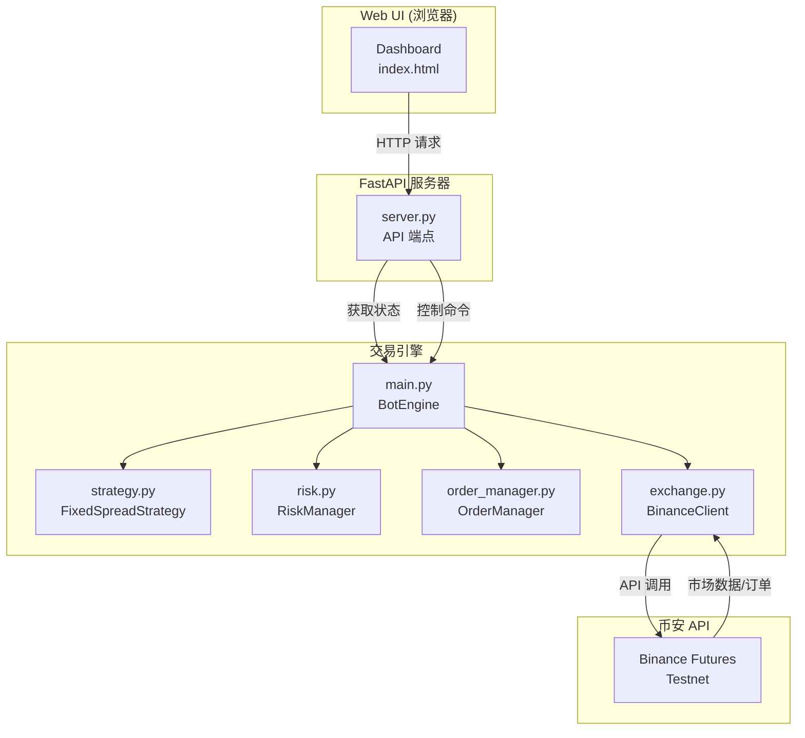
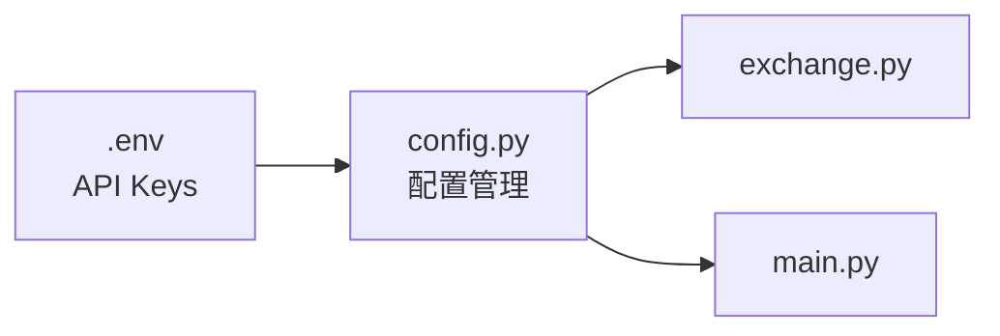
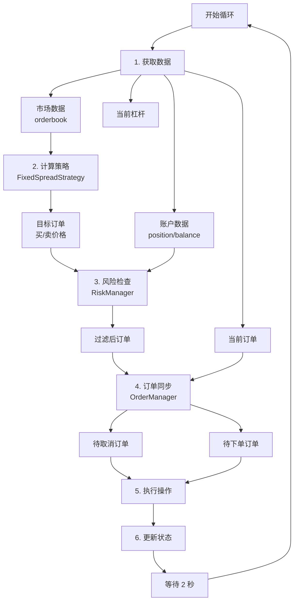
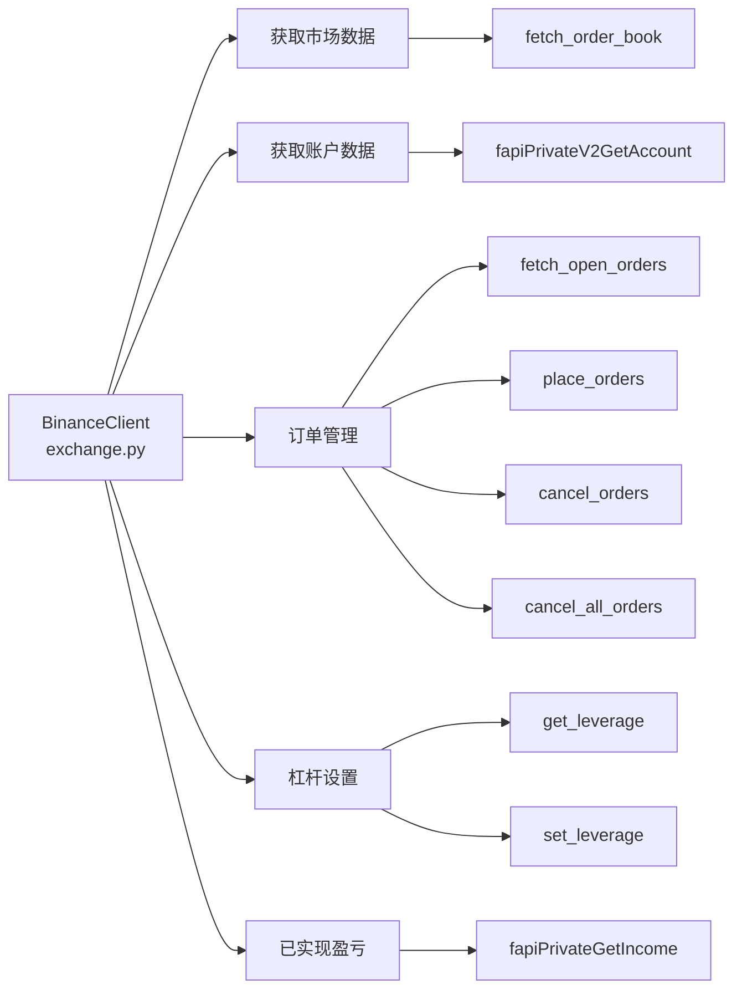
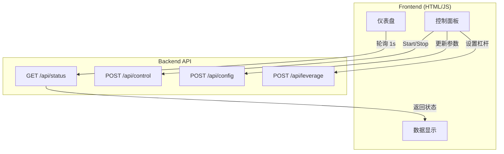
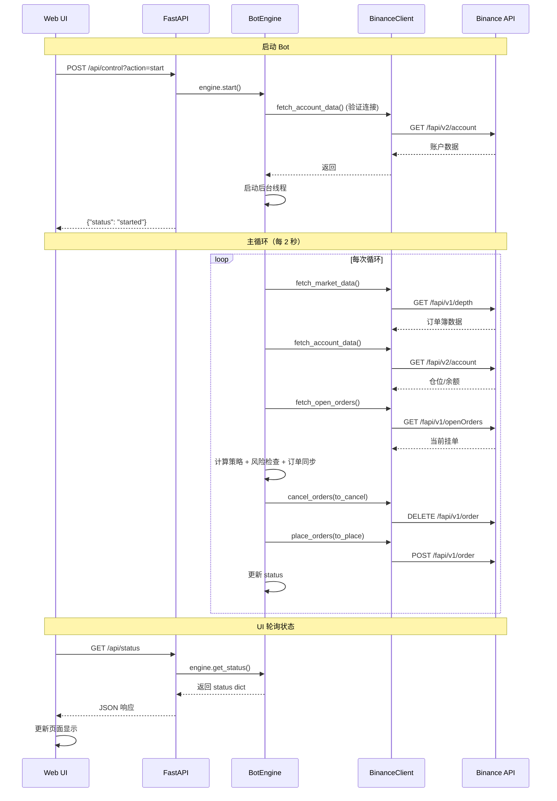
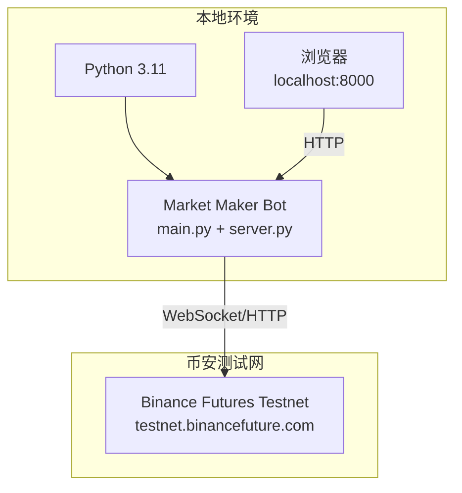

# 系统架构文档

## 系统概览

本项目实现了一个币安期货做市机器人，采用模块化设计，包含后端交易引擎和 Web UI 控制面板。



---

## 核心模块架构

### 1. 配置层（Configuration）



**职责**：
- 加载环境变量（API 密钥）
- 定义交易参数（交易对、价差、仓位限制、杠杆）
- 系统参数（刷新间隔、日志级别）

---

### 2. 交易引擎层（Trading Engine）



**关键组件**：

#### BotEngine (main.py)
- **职责**: 主循环编排，状态管理
- **功能**:
  - 启动/停止控制
  - 数据聚合
  - 异常处理和自动恢复

#### FixedSpreadStrategy (strategy.py)
- **职责**: 计算目标订单价格
- **算法**:
  ```
  mid_price = (best_bid + best_ask) / 2
  buy_price = mid_price × (1 - spread_pct)
  sell_price = mid_price × (1 + spread_pct)
  ```

#### RiskManager (risk.py)
- **职责**: 仓位限制检查
- **规则**:
  - `position >= MAX_POSITION` → 禁止买入
  - `position <= -MAX_POSITION` → 禁止卖出

#### OrderManager (order_manager.py)
- **职责**: 订单同步逻辑
- **算法**: Diff 当前订单 vs 目标订单
  - 找出需要取消的订单（价格不匹配）
  - 找出需要新增的订单

---

### 3. 交易所接口层（Exchange Interface）



**核心功能**：
- **市场数据**: 获取订单簿，计算中间价
- **账户数据**: 查询仓位、余额、入场价
- **订单管理**: 限价单下单、取消、批量取消
- **杠杆管理**: 获取/设置交易对杠杆
- **盈亏查询**: 获取已实现盈亏历史

---

### 4. Web UI 层（Web Interface）



**API 端点**：

| 端点 | 方法 | 功能 |
|------|------|------|
| `/` | GET | 返回 Dashboard HTML |
| `/api/status` | GET | 获取 bot 实时状态 |
| `/api/control` | POST | 启动/停止 bot |
| `/api/config` | POST | 更新策略参数 |
| `/api/leverage` | POST | 设置杠杆倍数 |

**状态数据结构**：
```json
{
  "mid_price": 2870.0,
  "position": -0.1,
  "balance": 6734.69,
  "orders": [...],
  "pnl": 1.0786,
  "realized_pnl": 0.0,
  "leverage": 5,
  "active": true,
  "error": null
}
```

---

## 数据流图



---

## 错误处理流程

```mermaid
graph TD
    Start[运行中] --> Error{异常发生}
    Error -->|单次循环异常| Log[记录错误日志]
    Log --> Continue[继续下一次循环]
    Continue --> Start
    
    Error -->|严重异常| Critical[捕获在外层]
    Critical --> SetError[设置 status.error]
    Critical --> Stop[调用 stop()]
    Stop --> CancelOrders[取消所有订单]
    CancelOrders --> StatusInactive[设置 active=False]
    StatusInactive --> UIShow[UI 显示 ERROR 状态]
```

**安全机制**：
1. **双层异常捕获**: 循环内 + 循环外
2. **自动停止**: 严重错误时自动停止并撤单
3. **状态同步**: 错误信息实时传递到 UI
4. **Stop 时撤单**: 确保无残留订单

---

## 部署架构



**运行方式**：
```bash
# 启动服务器（包含 Web UI + Bot 引擎）
python3.11 server.py

# 或单独运行 Bot（命令行模式）
python3.11 main.py
```

---

## 技术栈

| 层级 | 技术 | 用途 |
|------|------|------|
| **后端** | Python 3.11 | 主要编程语言 |
| **交易所 API** | ccxt | 统一交易所接口 |
| **Web 框架** | FastAPI | HTTP API 服务器 |
| **模板引擎** | Jinja2 | HTML 模板渲染 |
| **前端** | HTML/CSS/JS | 用户界面 |
| **配置管理** | python-dotenv | 环境变量加载 |

---

## 总结

该架构采用**分层解耦**设计：
- **展示层** (Web UI) 负责用户交互
- **应用层** (FastAPI) 负责 API 路由
- **业务层** (BotEngine) 负责策略编排
- **数据层** (BinanceClient) 负责外部交互

通过模块化设计，各组件职责清晰，易于测试和扩展。
