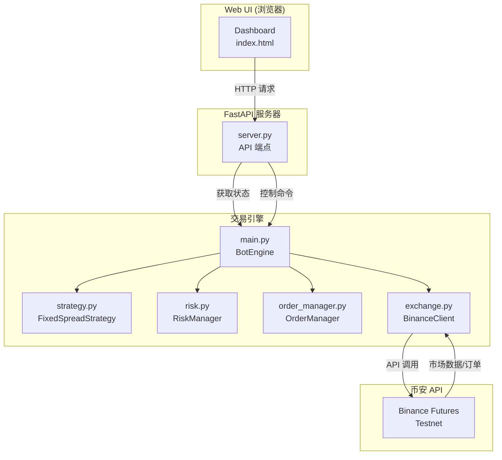
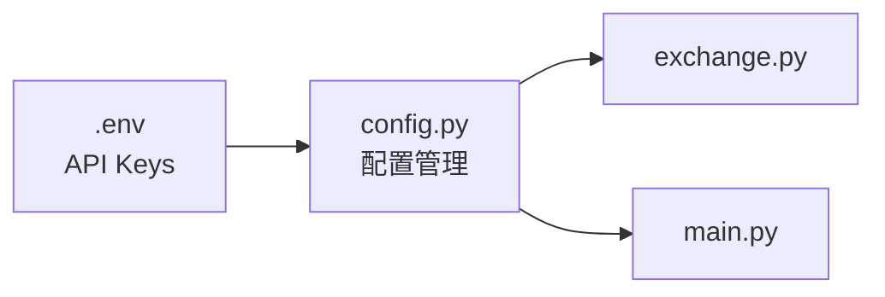
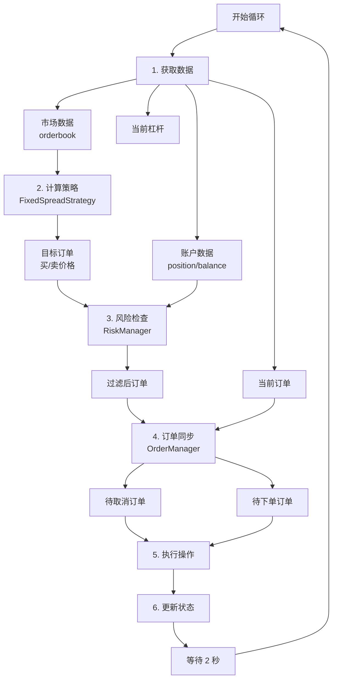
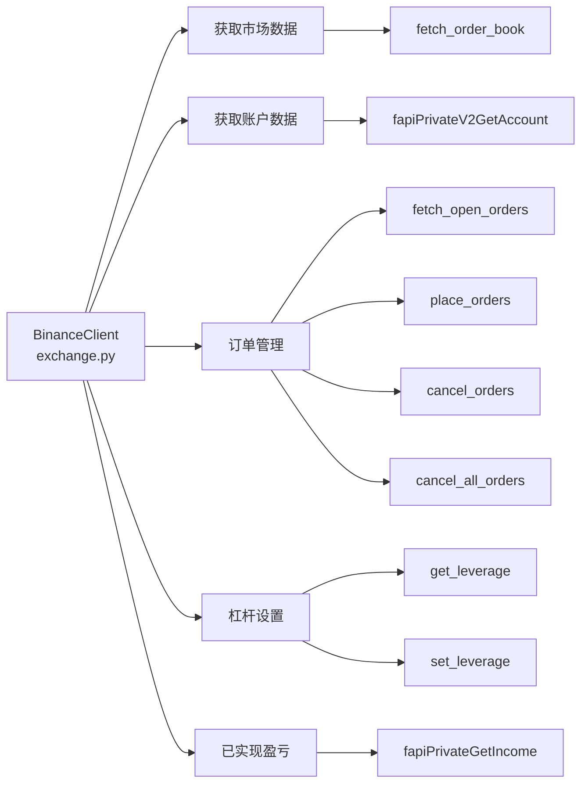
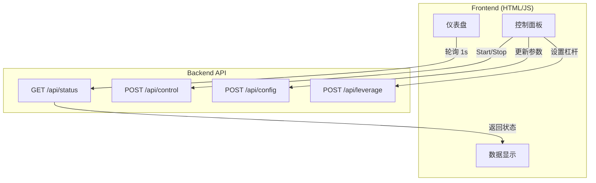
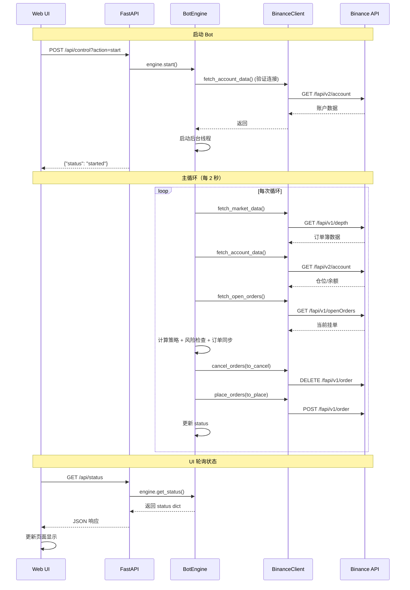
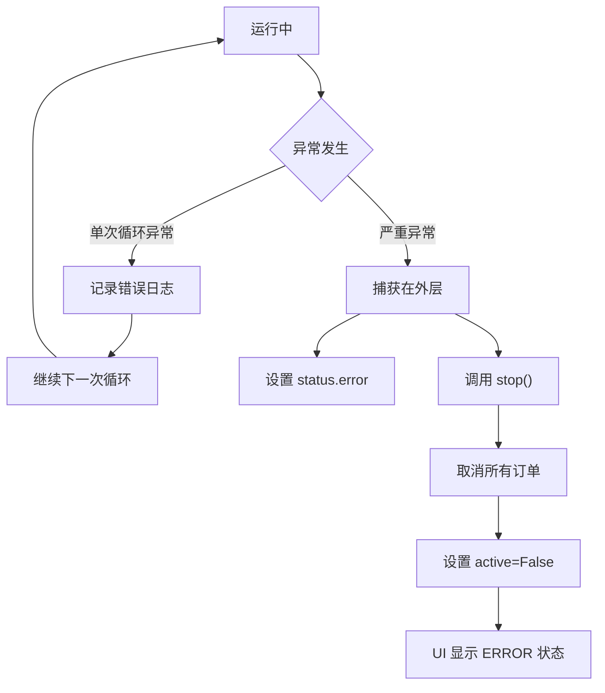
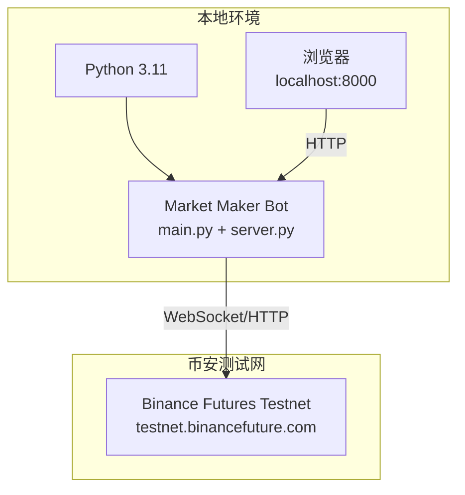

# System Architecture / 系统架构文档

## System Overview / 系统概览
This project implements a Binance Futures market-making bot with a modular design that separates the backend trading engine from the Web UI control panel.
本项目实现了一个币安期货做市机器人，采用模块化设计，将后端交易引擎与 Web UI 控制面板解耦。



---

## Core Module Architecture / 核心模块架构

### 1. Configuration Layer / 配置层（Configuration）



**Responsibilities / 职责**：
- Load environment variables (API keys) and expose them to all components.
  加载环境变量（API 密钥）并对所有组件可用。
- Define trading parameters such as symbol, spread, inventory caps, and leverage.
  定义交易参数，例如交易对、价差、仓位上限和杠杆倍数。
- Provide system-level settings including refresh intervals and logging detail.
  提供刷新间隔、日志级别等系统配置。

---

### 2. Trading Engine Layer / 交易引擎层（Trading Engine）



**Key Components / 关键组件**：

#### BotEngine (main.py)
- **Role**: Orchestrates the main loop and manages lifecycle state.
  **职责**：编排主循环并管理生命周期状态。
- **Functions**:
  - Start/stop control hooks.
    启动/停止控制。
  - Data aggregation across market, account, and orders.
    聚合市场、账户与订单数据。
  - Exception handling and automatic recovery.
    异常捕获与自动恢复。

#### FixedSpreadStrategy (strategy.py)
- **Role**: Calculate target bid/ask prices.
  **职责**：计算目标买卖价格。
- **Algorithm**:
  ```
  mid_price = (best_bid + best_ask) / 2
  buy_price = mid_price × (1 - spread_pct)
  sell_price = mid_price × (1 + spread_pct)
  ```
  **算法说明**：根据最新盘口中间价与设定价差推导买卖价位。

#### RiskManager (risk.py)
- **Role**: Enforce inventory limits before orders are placed.
  **职责**：在下单前执行库存限制。
- **Rules**:
  - `position >= MAX_POSITION` → block additional buys.
    `position >= MAX_POSITION` → 禁止继续买单。
  - `position <= -MAX_POSITION` → block additional sells.
    `position <= -MAX_POSITION` → 禁止继续卖单。

#### OrderManager (order_manager.py)
- **Role**: Diff current orders against targets and synchronize with the exchange.
  **职责**：比较当前订单与目标订单并与交易所同步。
- **Logic**:
  - Identify stale orders (price mismatch) to cancel.
    找出需要取消的过期订单（价格不匹配）。
  - Submit new orders for missing price levels.
    提交缺失的目标价格新订单。

---

### 3. Exchange Interface Layer / 交易所接口层（Exchange Interface）



**Core Functions / 核心功能**：
- **Market Data**: Fetch order books and derive mid prices.
  **市场数据**：获取订单簿并计算中间价。
- **Account Data**: Pull balances, positions, and entry prices.
  **账户数据**：查询余额、仓位与入场价。
- **Order Management**: Place, cancel, and bulk-cancel limit orders.
  **订单管理**：执行限价单下单、撤单与批量撤单。
- **Leverage Control**: Read or update symbol leverage.
  **杠杆管理**：获取或调整交易对杠杆倍数。
- **PnL Tracking**: Retrieve realized PnL history for monitoring.
  **盈亏查询**：获取已实现盈亏记录用于监控。

---

### 4. Web Interface Layer / Web UI 层（Web Interface）



**API Endpoints / API 端点**：
- `/` (GET): Returns the Dashboard HTML page.
  `/` (GET)：返回 Dashboard 主页面。
- `/api/status` (GET): Provides real-time bot status for UI polling.
  `/api/status` (GET)：向前端轮询提供实时状态。
- `/api/control` (POST): Start or stop the bot loop.
  `/api/control` (POST)：启动或停止 Bot 循环。
- `/api/config` (POST): Update strategy parameters (spread, quantity, etc.).
  `/api/config` (POST)：更新策略参数（价差、数量等）。
- `/api/leverage` (POST): Adjust symbol leverage via the exchange API.
  `/api/leverage` (POST)：通过交易所接口调整杠杆。

**Status Payload / 状态数据结构**：
```json
{
  "mid_price": 2870.0,
  "position": -0.1,
  "balance": 6734.69,
  "orders": [...],
  "pnl": 1.0786,
  "realized_pnl": 0.0,
  "leverage": 5,
  "active": true,
  "error": null
}
```

---

## Data Flow Diagram / 数据流图



---

## Error Handling Flow / 错误处理流程



**Safety Mechanisms / 安全机制**：
1. **Dual exception guards**: Inner-loop try/except plus outer wrapper.
   **双层异常捕获**：循环内与外层都设置 try/except。
2. **Automatic stop**: Severe errors trigger an immediate stop and mass cancel.
   **自动停止**：严重错误会立即停止循环并批量撤单。
3. **State sync**: Errors propagate to the UI via `status.error`.
   **状态同步**：错误通过 `status.error` 实时传递到前端。
4. **Graceful shutdown**: `stop()` routine enforces order cancellation before exit.
   **优雅停机**：`stop()` 会在退出前确保撤单完成。

---

## Deployment Architecture / 部署架构



**Run Modes / 运行方式**：
```bash
# 启动服务器（包含 Web UI + Bot 引擎）
python3.11 server.py

# 或单独运行 Bot（命令行模式）
python3.11 main.py
```

---

## Tech Stack / 技术栈

| Layer | Technology | Purpose |
|-------|------------|---------|
| Backend / 后端 | Python 3.11 | Primary implementation language / 主要编程语言 |
| Exchange API / 交易所 API | ccxt | Unified Binance Futures client / 统一交易所接口 |
| Web Framework / Web 框架 | FastAPI | HTTP API server / HTTP API 服务器 |
| Templating / 模板引擎 | Jinja2 | Render HTML dashboard / 渲染 Dashboard HTML |
| Frontend / 前端 | HTML·CSS·JS | Browser UI / 浏览器界面 |
| Config / 配置管理 | python-dotenv | Load environment secrets / 加载环境变量与密钥 |

---

## Summary / 总结
The architecture follows a layered, decoupled design: presentation (Web UI), application (FastAPI), business logic (BotEngine), and data access (BinanceClient). Clear boundaries keep testing straightforward and make future extensions safe.
该架构遵循分层解耦思路：展示层（Web UI）、应用层（FastAPI）、业务层（BotEngine）、数据层（BinanceClient）。明确的边界便于测试，也让后续扩展更加安全。
