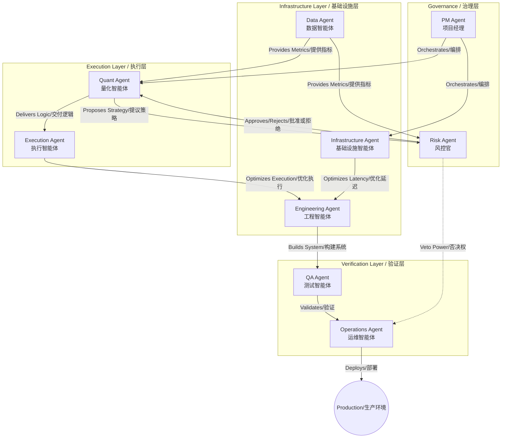

# Agent Roles and Hierarchy / 智能体角色与层级关系

## 1. Overview / 概述
This document defines the specific responsibilities of each agent in the AlphaLoop framework and their hierarchical relationships. The system is designed with "Checks and Balances" rather than a simple top-down command structure.

本文档定义了 AlphaLoop 框架中每个智能体的具体职责及其层级关系。系统的设计理念是“制衡”，而不是简单的自上而下的指挥结构。

## 1. The Organization Chart / 组织架构图

Imagine AlphaLoop as a hedge fund. Here are the departments:
将 AlphaLoop 想象成一家对冲基金。以下是各个部门：

*   **Governance (The Bosses)**: Set goals and rules. (PM, Risk)
    *   **治理层（老板）**：设定目标和规则。（PM，风控）
*   **Execution (The Traders)**: Make the money. (Quant, Exec)
    *   **执行层（交易员）**：赚钱。（量化，执行）
*   **Infrastructure (The Support)**: Keep the lights on. (Infra, Data, Eng, Ops, QA)
    *   **基础设施层（后勤）**：保障运行。（基础，数据，工程，运维，测试）

## 2. Hierarchy & Interaction Diagram / 层级与交互图

## 3. Detailed Roles / 详细角色

### A. Governance Layer / 治理层

#### 1. Project Manager Agent (The Delivery Lead) / 项目管理智能体（交付负责人）
*   **Role**: Process Orchestrator.
    *   **角色**：流程编排者。
*   **Responsibilities / 职责**:
    *   **Backlog Management**: Maintains `task.md`, prioritizes features. (维护待办事项，确定功能优先级)
    *   **Conflict Resolution**: Mediates if Risk and Quant are deadlocked. (调解风控和量化的僵局)
    *   **Reporting**: Generates daily summaries for human stakeholders. (生成每日摘要)
*   **Hierarchy**: Reports to Human Stakeholders. Directs the workflow of Execution Agents.
    *   **层级**：向人类利益相关者汇报。指导执行智能体的工作流。

#### 2. Risk Agent (The CRO) / 风控智能体（首席风险官）
*   **Role**: Gatekeeper.
    *   **角色**：守门人。
*   **Responsibilities / 职责**:
    *   **Compliance Checks**: Ensures code meets regulatory standards. (确保代码符合监管标准)
    *   **Risk Limits**: Enforces hard limits (e.g., Max Position, Max Drawdown). (执行硬性限制，如最大持仓、最大回撤)
    *   **Veto Power**: Can block ANY deployment, regardless of approval from others. (可以阻止任何部署，无论其他人是否批准)
*   **Hierarchy**: Independent. Does not report to PM. Has authority over Quant and Ops regarding safety.
    *   **层级**：独立。不向 PM 汇报。在安全性方面对量化和运维拥有权威。

### B. Execution Layer / 执行层

#### 3. Quant Agent (The Trader) / 量化智能体（交易员）
*   **Role**: Value Generator.
    *   **角色**：价值创造者。
*   **Focus**: Layer 4 (Strategy Performance).
    *   **关注点**：第四层（策略绩效）。
*   **Responsibilities / 职责**:
    *   **Strategy Design**: Proposes changes to trading logic (`strategy.py`). (提议修改交易逻辑)
*   **Hierarchy**: Reports to PM. Constrained by Risk.
    *   **层级**：向 PM 汇报。受风控约束。

#### 4. Execution Agent (The Algo Trader) / 执行智能体（算法交易员）
*   **Role**: Efficiency Expert.
    *   **角色**：效率专家。
*   **Focus**: Layer 2 (Execution Quality).
    *   **关注点**：第二层（执行质量）。
*   **Responsibilities / 职责**:
    *   **Slippage Control**: Optimizes order types (Maker vs Taker). (优化订单类型)
    *   **Impact Reduction**: Implements TWAP/VWAP logic. (实现 TWAP/VWAP 逻辑)
*   **Hierarchy**: Receives signals from Quant.
    *   **层级**：接收量化智能体的信号。

### C. Infrastructure Layer / 基础设施层

#### 5. Infrastructure Agent (The Plumber) / 基础设施智能体（管道工）
*   **Role**: Connectivity Guardian.
    *   **角色**：连接守护者。
*   **Focus**: Layer 1 (Infrastructure & Connectivity).
    *   **关注点**：第一层（基础设施与连接性）。
*   **Responsibilities / 职责**:
    *   **Latency Optimization**: Monitors Tick-to-Trade time. (监控 Tick-to-Trade 时间)
    *   **Stability**: Manages WebSocket sequence gaps and reconnections. (管理 WebSocket 序列缺口和重连)
*   **Hierarchy**: Reports to Engineering/PM.
    *   **层级**：向工程/PM 汇报。

#### 6. Data Agent (The Analyst) / 数据智能体（分析师）
*   **Role**: Metrics Engine.
    *   **角色**：指标引擎。
*   **Focus**: Cross-Layer Metrics.
    *   **关注点**：跨层指标。
*   **Responsibilities / 职责**:
    *   **Pipeline**: Manages data ingestion (Ticks, Trades). (管理数据摄入)
    *   **Calculation**: Computes real-time metrics (Markout PnL, Volatility). (计算实时指标)
*   **Hierarchy**: Serves Quant and Risk. Reports to PM.
    *   **层级**：服务于量化和风控。向 PM 汇报。

#### 7. Engineering Agent (The Architect) / 工程智能体（架构师）
*   **Role**: Builder.
    *   **角色**：建设者。
*   **Responsibilities / 职责**:
    *   **Implementation**: Writes the core infrastructure code. (编写核心基础设施代码)
    *   **Refactoring**: Maintains code quality and technical debt. (维护代码质量和技术债务)
*   **Hierarchy**: Reports to PM. Collaborates with Quant.
    *   **层级**：向 PM 汇报。与量化协作。

### C. Verification Layer / 验证层

#### 5. QA Agent (The Tester) / 测试智能体（测试员）
*   **Role**: Quality Assurance.
    *   **角色**：质量保证。
*   **Responsibilities / 职责**:
    *   **Test Coverage**: Writes unit and integration tests. (编写单元和集成测试)
    *   **Bug Hunting**: Actively tries to break the system. (主动尝试破坏系统)
*   **Hierarchy**: Gatekeeper for Engineering. Must pass before Ops takes over.
    *   **层级**：工程的守门人。必须通过测试，运维才会接手。

#### 6. Operations Agent (The SRE) / 运维智能体（SRE）
*   **Role**: Production Guardian.
    *   **角色**：生产环境守护者。
*   **Responsibilities / 职责**:
    *   **CI/CD**: Manages the build and deployment pipelines. (管理构建和部署流水线)
    *   **Monitoring**: Watches production health and executes rollbacks. (监控生产健康状况并执行回滚)
*   **Hierarchy**: Final executor. Reports to PM on uptime.
    *   **层级**：最终执行者。就正常运行时间向 PM 汇报。
