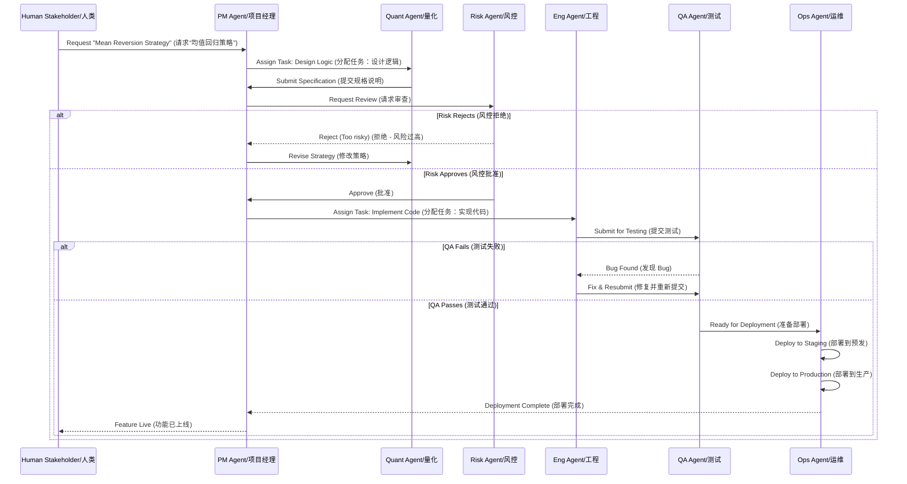
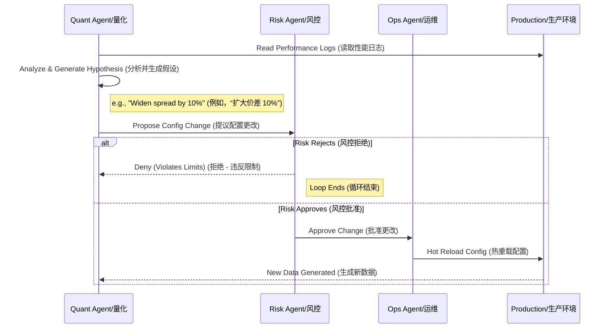
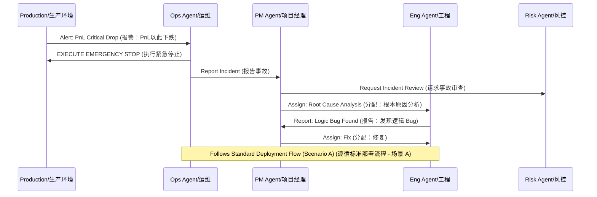

# Agent Business Workflows / 智能体业务流程

## 1. Overview / 概述
This document details the step-by-step interactions between agents for specific business scenarios. It maps the lifecycle of a task from inception to production.

本文档详细说明了特定业务场景下智能体之间的一步步交互。它映射着任务从开始到生产的生命周期。

### Scenario A: The "New Idea" Flow / 场景 A：“新想法”流程
**Story**: A human stakeholder wants a new "Mean Reversion" strategy.
**故事**：人类利益相关者想要一个新的“均值回归”策略。

**Steps / 步骤**:
1.  **Human** tells **PM**: "I want this."
2.  **PM** asks **Quant**: "Design it."
3.  **Quant** writes the logic.
4.  **Risk** checks: "Is it safe?" (Crucial Step!)
5.  **Eng** builds it.
6.  **QA** tests it.
7.  **Ops** deploys it.

### Scenario B: The "Self-Optimization" Loop / 场景 B：“自我优化”循环
**Story**: The system is running. The Quant Agent notices we are losing money because the spread is too tight.
**故事**：系统正在运行。量化智能体注意到我们因为价差太窄而亏损。

**Steps / 步骤**:
1.  **Quant** reads the data (from Data Agent).
2.  **Quant** thinks: "If I widen the spread, we make more."
3.  **Quant** asks **Risk**: "Can I change spread to 0.5%?"
4.  **Risk** checks limits: "Yes, 0.5% is safe."
5.  **Ops** updates the live system.

## 4. Scenario C: Production Incident Response / 场景 C：生产事故响应
**Trigger**: Production PnL drops below safety threshold.
**触发器**：生产环境 PnL 跌破安全阈值。

