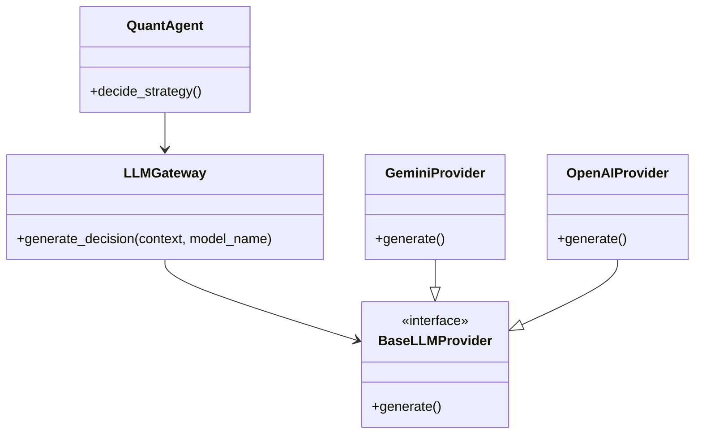

# LLM Integration & Multi-Model Architecture Assessment

**Goal**: Enable `QuantAgent` to utilize different LLMs (Gemini, GPT-4, Claude) based on user selection.

## 1. Do we need a separate Agent? (我们需要单独的 Agent 吗？)

**Verdict: NO.**

You do **not** need a separate "LLM Agent" in the AlphaLoop sense.
*   **Why?** In AlphaLoop, an "Agent" represents a *role* in the trading business (e.g., Risk Manager, Data Analyst, Trader).
*   **LLM is a Tool**: The LLM is a *brain* or a *tool* used by the `QuantAgent` to make decisions. It is not a role itself.
*   **Analogy**: A trader (QuantAgent) can choose to use a Calculator (Rule-based) or a Supercomputer (LLM). The "Supercomputer" is not a colleague; it's a tool the trader uses.

**Architecture Recommendation**:
Implement an **Infrastructure Layer (Service)** called `LLMGateway` or `ModelFactory`. The `QuantAgent` simply asks this service for an analysis, regardless of which model is running behind the scenes.

## 2. Proposed Architecture: The Adapter Pattern

We should use the **Adapter Pattern** to standardize different LLM APIs.

## 3. Workload Impact (Multi-Model Support)

Adding multi-model support increases the **Phase 1 (Infrastructure)** workload but keeps the Agent logic clean.

### Phase 1: Infrastructure (Enhanced) - High Complexity
*   **Task**: Create `alphaloop/core/llm/` package.
*   **Task**: Define `BaseLLMProvider` abstract base class.
*   **Task**: Implement `GeminiProvider` (using google-generativeai).
*   **Task**: Implement `OpenAIProvider` (using openai sdk) - *Optional for now*.
*   **Task**: Create `LLMFactory` to instantiate the correct provider based on config.
*   **My Effort**: ~8-12 tool calls.

### Phase 2: Configuration & UI
*   **Task**: Update `config.py` to allow selecting `ACTIVE_MODEL` (e.g., "gemini-1.5-pro", "gpt-4o").
*   **Task**: Update Frontend Settings UI to include a "Model Selection" dropdown.
*   **My Effort**: ~4-6 tool calls.

## 4. Strategic Benefits

1.  **Fallback Redundancy**: If Gemini API goes down, the system can auto-switch to GPT-4.
2.  **Cost Optimization**: Use cheaper models (Gemini Flash) for frequent checks, and expensive models (GPT-4 / Gemini Pro) for major rebalancing.
3.  **A/B Testing**: You can run two bots with different models and compare `Sharpe Ratio`.

## 5. Revised Recommendation

Proceed with the **LLMGateway** architecture.
1.  **Step 1**: Build the Interface and Gemini Provider first.
2.  **Step 2**: Refactor `QuantAgent` to use the Interface.
3.  **Step 3**: Add other providers (OpenAI/Anthropic) later as plugins.

This avoids "Agent Bloat" and keeps the system clean.
