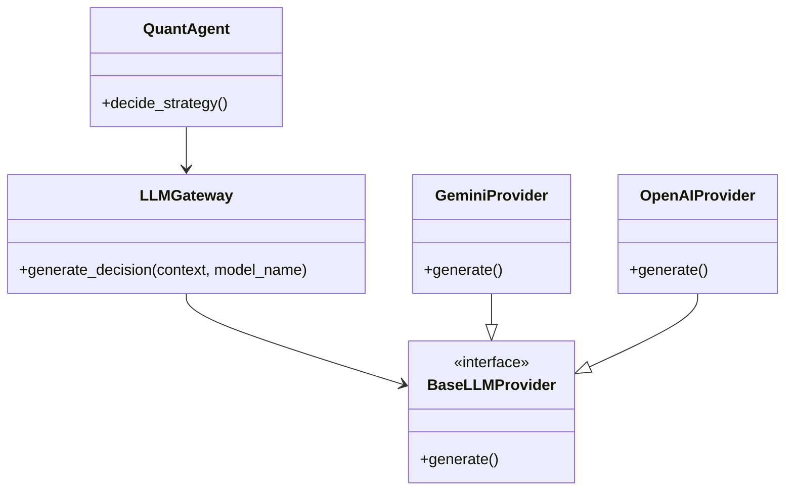

# LLM Integration & Multi-Model Architecture Assessment / LLM 集成与多模型架构评估

**Goal**: Allow `QuantAgent` to switch between Gemini, GPT‑4, Claude, or future LLMs according to user input.
**目标**：让 `QuantAgent` 能依据用户选择在 Gemini、GPT‑4、Claude 等当前或未来模型之间切换。

## 1. Do we need a separate Agent? / 我们需要单独的 Agent 吗？

**Verdict: NO.**
**结论：不需要。**

AlphaLoop agents map to business roles (Risk, Data, Quant). An LLM is simply a tool these roles invoke, so creating a new “LLM Agent” would dilute the role model without adding governance value.
AlphaLoop 的智能体对应具体业务角色（风控、数据、量化），而 LLM 只是这些角色调用的工具；若新增 “LLM Agent” 只会稀释角色模型，不会带来额外治理价值。

- **LLM as tool**: `QuantAgent` can swap between deterministic code and LLM inference just like switching calculators.
  **LLM 作为工具**：`QuantAgent` 只是在确定性逻辑与 LLM 推理间切换，类似更换计算器。
- **Org clarity**: Keeping roles unchanged preserves segregation of duties.
  **组织清晰度**：保持角色不变即可维持职责分离。

**Architecture Recommendation / 架构建议**：
Introduce an infrastructure service named `LLMGateway` / `ModelFactory`. `QuantAgent` requests analysis from the gateway while the gateway routes to the selected provider.
新增名为 `LLMGateway` 或 `ModelFactory` 的基础设施服务；`QuantAgent` 只负责请求分析，由网关路由到指定模型。

## 2. Proposed Architecture: Adapter Pattern / 适配器模式方案

We normalize provider differences with the Adapter Pattern so every model exposes the same interface.
通过适配器模式屏蔽供应商差异，使每个模型都暴露统一接口。

## 3. Workload Impact (Multi-Model Support) / 多模型工作量影响

Adding multi-model support mainly increases infrastructure work while the agent logic stays lean.
多模型支持主要增加基础设施侧工作量，智能体逻辑保持精简。

### Phase 1: Infrastructure (High) / 阶段 1：基础设施（高）
- Create `alphaloop/core/llm/`, define `BaseLLMProvider`, implement `GeminiProvider`, optionally `OpenAIProvider`, and build `LLMFactory`.
  新建 `alphaloop/core/llm/`，定义 `BaseLLMProvider`，实现 `GeminiProvider`（及可选的 `OpenAIProvider`），并构建 `LLMFactory`。
- Effort: ~8‑12 tool calls.
  预计投入：约 8‑12 次工具调用。

### Phase 2: Configuration & UI / 阶段 2：配置与界面
- Add `ACTIVE_MODEL` to `config.py` and expose a model dropdown in the settings UI.
  在 `config.py` 增加 `ACTIVE_MODEL`，并在前端设置页面提供模型下拉框。
- Effort: ~4‑6 tool calls.
  预计投入：约 4‑6 次工具调用。

## 4. Strategic Benefits / 战略收益

1. **Fallback redundancy** – Auto-switch to GPT‑4 if Gemini degrades.
   **冗余切换**：Gemini 出现异常时自动切到 GPT‑4。
2. **Cost optimization** – Use Gemini Flash for frequent checks and premium models for major rebalance decisions.
   **成本优化**：常规检查用 Gemini Flash，重大调仓使用高阶模型。
3. **A/B testing** – Run parallel bots with different models to compare Sharpe or latency.
   **A/B 测试**：并行运行不同模型的机器人，比较夏普或延迟。

## 5. Revised Recommendation / 更新建议

Adopt the **LLMGateway** approach to avoid agent bloat:
采纳 **LLMGateway** 方案以避免智能体膨胀：

1. Build the interface plus Gemini provider first.
   先实现接口与 Gemini 提供方。
2. Refactor `QuantAgent` to depend on the gateway.
   重构 `QuantAgent` 经由 Gateway 调用模型。
3. Add OpenAI/Anthropic providers later as plug-ins.
   之后再以插件形式加入 OpenAI / Anthropic 提供方。
