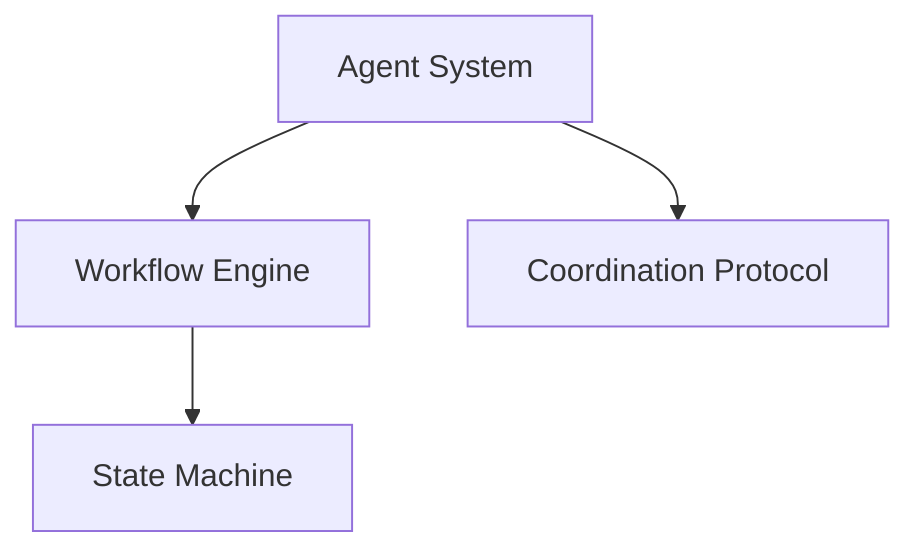

# Multi-Agent Development Framework Extraction Guide
# 多 Agent 开发框架提取指南

**Document Version / 文档版本**: 1.0.0  
**Date / 日期**: 2025-12-10  
**Source Project / 来源项目**: MarketMakerDemo  
**Purpose / 目的**: Extract reusable multi-agent development framework components / 提取可复用的多 Agent 开发框架组件

---

## 📋 Table of Contents / 目录

1. [Overview / 概述](#overview)
2. [Extractable Components / 可提取组件](#extractable-components)
3. [File Format Recommendations / 文件格式建议](#file-format-recommendations)
4. [Extraction Schemes / 提取方案](#extraction-schemes)
5. [Implementation Plan / 实施计划](#implementation-plan)
6. [Examples / 示例](#examples)

---

## Overview / 概述

This document identifies reusable components from the MarketMakerDemo project that can be extracted into a standalone multi-agent development framework.

本文档识别了 MarketMakerDemo 项目中可提取为独立多 Agent 开发框架的可复用组件。

### Key Principles / 核心原则

1. **Separation of Concerns / 关注点分离**: Framework components are independent of business logic
2. **Configurability / 可配置性**: Framework can be customized for different project types
3. **Reusability / 可复用性**: Components can be used across multiple projects
4. **Maintainability / 可维护性**: Clear structure and documentation

---

## Extractable Components / 可提取组件

### 1. Core Architecture Components / 核心架构组件

#### 1.1 Agent Role System / Agent 角色体系
**Reusability / 可复用性**: ⭐⭐⭐⭐⭐ (Very High)

**Components / 组件**:
- 10-Agent layered architecture (Management, Development, Quality, Operations)
- Agent responsibility matrix and file ownership rules
- Agent initialization protocol (via `docs/agents/AGENT_XXX.md`)
- Automatic role identification mechanism (based on `status/roadmap.json`)

**Source Files / 源文件**:
- `docs/agents/README.md`
- `docs/agents/AGENT_*.md`
- `.cursorrules` (Agent system definition section)

#### 1.2 Workflow Pipeline / 工作流管道
**Reusability / 可复用性**: ⭐⭐⭐⭐⭐ (Very High)

**Components / 组件**:
- 14-step development pipeline (Spec → Story → AC → Contract → Test → Code → Review → ...)
- State machine management (`status/roadmap.json`)
- Step dependencies and blocker detection
- TDD enforcement (tests before code)

**Source Files / 源文件**:
- `.cursorrules` (Development Pipeline section)
- `status/roadmap.json` (schema and structure)
- `docs/agents/README.md` (Pipeline Steps table)

#### 1.3 Interface Contract System / 接口契约系统
**Reusability / 可复用性**: ⭐⭐⭐⭐⭐ (Very High)

**Components / 组件**:
- JSON Schema contract definitions (`contracts/{module}.json`)
- Contract-driven development pattern
- Interface change notification mechanism
- Backward compatibility checks

**Source Files / 源文件**:
- `contracts/*.json`
- `docs/agents/AGENT_ARCH.md`

### 2. Collaboration Mechanisms / 协作机制

#### 2.1 Cross-Agent Request Protocol / 跨 Agent 请求协议
**Reusability / 可复用性**: ⭐⭐⭐⭐⭐ (Very High)

**Components / 组件**:
- `status/agent_requests.json` request tracking
- Request types (INTERFACE, CONFIG, BLOCKER, REVIEW, CLARIFY)
- Priority and status management
- Request-response workflow

**Source Files / 源文件**:
- `.cursorrules` (Cross-Agent Request Protocol section)
- `status/agent_requests.json` (structure)

#### 2.2 File Ownership Matrix / 文件归属矩阵
**Reusability / 可复用性**: ⭐⭐⭐⭐⭐ (Very High)

**Components / 组件**:
- EXCLUSIVE (exclusive ownership)
- COORDINATED (requires coordination)
- SHARED-APPEND (shared append)
- Conflict avoidance rules

**Source Files / 源文件**:
- `.cursorrules` (File Ownership Matrix section)
- `docs/agents/README.md` (File Ownership table)

#### 2.3 Tiered Context Architecture / 上下文分层架构
**Reusability / 可复用性**: ⭐⭐⭐⭐ (High, needs LLM platform adaptation)

**Components / 组件**:
- Working Context (work context)
- Session (session)
- Memory (memory)
- Artifacts (artifacts)
- Context compilation process

**Source Files / 源文件**:
- `.cursorrules` (Context Tiered Architecture section)

### 3. Reasoning Framework / 推理框架

#### 3.1 Pre-Thinking Mandatory Checklist / 思维前置检查清单
**Reusability / 可复用性**: ⭐⭐⭐⭐⭐ (Very High)

**Components / 组件**:
- 8-step checklist (Task Classification, Constraint Analysis, Risk Assessment, Information Gathering, Hypothesis Formation, Expert Consultation, Solution Design, Self-Check)
- Multi-perspective expert consultation mechanism
- Complexity-based output format
- Plan/Code mode integration

**Source Files / 源文件**:
- `.cursorrules` (Section 1.0 Pre-Thinking Mandatory Checklist)
- `docs/project/pre_thinking_framework_proposal.md`

#### 3.2 Decision Responsibility Matrix / 决策责任矩阵
**Reusability / 可复用性**: ⭐⭐⭐⭐⭐ (Very High)

**Components / 组件**:
- Decision Agent vs Operation Agent
- Input-output data flow
- Decision authority and constraints
- Conflict resolution priorities

**Source Files / 源文件**:
- `.cursorrules` (Decision Flow and Data Flow section)

### 4. Quality Assurance Mechanisms / 质量保证机制

#### 4.1 Test Layering System / 测试分层体系
**Reusability / 可复用性**: ⭐⭐⭐⭐⭐ (Very High)

**Components / 组件**:
- Unit Tests
- Smoke Tests
- Integration Tests
- Contract Tests
- E2E Tests

**Source Files / 源文件**:
- `pytest.ini` (test markers)
- `tests/` directory structure
- `docs/agents/AGENT_QA.md`

#### 4.2 Code Review Process / 代码审查流程
**Reusability / 可复用性**: ⭐⭐⭐⭐⭐ (Very High)

**Components / 组件**:
- Structured review reports (`logs/reviews/{feature_id}.json`)
- Review standards and checklists
- Review result tracking

**Source Files / 源文件**:
- `logs/reviews/*.json` (structure)
- `docs/agents/AGENT_REVIEW.md`

### 5. Project Management Tools / 项目管理工具

#### 5.1 Progress Tracking System / 进度跟踪系统
**Reusability / 可复用性**: ⭐⭐⭐⭐⭐ (Very High)

**Components / 组件**:
- `status/roadmap.json` feature status management
- Event log (`docs/progress/progress_index.json`)
- Blocker detection and dependency management
- Automated state advancement scripts

**Source Files / 源文件**:
- `status/roadmap.json` (schema)
- `docs/progress/` directory

#### 5.2 Audit Trail / 审计追踪
**Reusability / 可复用性**: ⭐⭐⭐⭐⭐ (Very High)

**Components / 组件**:
- `logs/audit_trail.json` append-only log
- Change history records
- Traceability

**Source Files / 源文件**:
- `logs/audit_trail.json` (structure)

### 6. Development Standards / 开发规范

#### 6.1 `.cursorrules` Template / CursorRules 模板
**Reusability / 可复用性**: ⭐⭐⭐⭐⭐ (Very High)

**Components / 组件**:
- Multi-language support (Chinese/English bilingual)
- Task complexity classification
- Plan/Code workflow
- Risk and constraint management
- Prohibited operations list

**Source Files / 源文件**:
- `.cursorrules` (entire file)

#### 6.2 Git Workflow Standards / Git 工作流规范
**Reusability / 可复用性**: ⭐⭐⭐⭐⭐ (Very High)

**Components / 组件**:
- Commit message format (type(scope): description)
- Branch strategy
- CI/CD integration (optional skip mechanism)

**Source Files / 源文件**:
- `.cursorrules` (Git commit specification section)
- `.github/workflows/ci.yml`

### 7. Infrastructure Components / 基础设施组件

#### 7.1 Environment Management / 环境管理
**Reusability / 可复用性**: ⭐⭐⭐ (Medium, needs tech stack adaptation)

**Components / 组件**:
- Standardized startup script (`start_server.sh`)
- Environment verification script (`scripts/verify_server_env.sh`)
- `.env.example` template
- Environment consistency guarantee

**Source Files / 源文件**:
- `start_server.sh`
- `scripts/verify_server_env.sh`
- `.env.example`
- `docs/project/environment_consistency.md`

#### 7.2 Logging Management / 日志管理
**Reusability / 可复用性**: ⭐⭐⭐⭐ (High)

**Components / 组件**:
- Structured logging (JSON format)
- Log rotation strategy
- Log level configuration
- Centralized log output

**Source Files / 源文件**:
- `src/shared/logger.py`
- `docs/project/logging_management.md`

#### 7.3 CI/CD Pipeline / CI/CD 管道
**Reusability / 可复用性**: ⭐⭐⭐ (Medium, needs CI/CD platform adaptation)

**Components / 组件**:
- GitHub Actions workflow
- Optional CI/CD skip mechanism (`[skip ci]`)
- Test, Lint, Documentation generation

**Source Files / 源文件**:
- `.github/workflows/ci.yml`

### 8. Documentation System / 文档体系

#### 8.1 Agent Documentation Template / Agent 文档模板
**Reusability / 可复用性**: ⭐⭐⭐⭐⭐ (Very High)

**Components / 组件**:
- Responsibility definition
- File ownership
- Collaboration guidelines
- Initialization prompts

**Source Files / 源文件**:
- `docs/agents/AGENT_*.md` (template structure)

#### 8.2 Architecture Documentation Standards / 架构文档规范
**Reusability / 可复用性**: ⭐⭐⭐⭐⭐ (Very High)

**Components / 组件**:
- Chinese/English bilingual requirement
- Module cards (`docs/modules/{module}.json`)
- Interface documentation
- User guides

**Source Files / 源文件**:
- `docs/modules/*.json`
- `docs/user_guide/` structure

---

## File Format Recommendations / 文件格式建议

### Recommended Format Scheme / 推荐格式方案

| Component Type / 组件类型 | Recommended Format / 推荐格式 | Rationale / 理由 |
|-------------------------|------------------------------|-----------------|
| Agent Role Definition / Agent角色定义 | YAML | Human-readable, easy to edit / 人类可读，易于编辑 |
| Workflow Definition / 工作流定义 | JSON Schema | Structured, verifiable / 结构化，可验证 |
| File Ownership Rules / 文件归属规则 | TOML | Clear structure, supports comments / 清晰结构，支持注释 |
| .cursorrules Template / .cursorrules模板 | Jinja2 | Parameterizable / 可参数化 |
| Agent Doc Template / Agent文档模板 | Markdown + Front Matter | Standard, easy to edit / 标准，易编辑 |
| Project Structure / 项目结构 | Directory Tree + Placeholders | Ready to use / 可直接使用 |
| Core Logic / 核心逻辑 | Python Package | Testable, maintainable / 可测试，可维护 |
| Tool Scripts / 工具脚本 | Python CLI | Interactive, extensible / 交互式，可扩展 |
| Framework Documentation / 框架文档 | Markdown + Mermaid | Visualizable, easy to understand / 可视化，易理解 |

### Detailed Format Specifications / 详细格式规范

#### 1. Agent Role Definition / Agent 角色定义
**Format**: YAML

```yaml
# config/agent_roles.yaml
agents:
  - id: "pm"
    name: "Project Manager"
    name_zh: "项目管理"
    layer: "management"
    responsibilities:
      - "progress_tracking"
      - "coordination"
      - "risk_management"
    owned_directories:
      - "status/"
      - "logs/"
      - "docs/agents/"
    pipeline_steps: [12]
    initialization_prompt: |
      请阅读文件 docs/agents/AGENT_PM.md，了解你作为该 Agent 的职责和规范。
      从现在开始，你只负责该文件中指定的模块。
```

**Advantages / 优点**:
- Human-readable / 人类可读
- Easy to edit and extend / 易于编辑和扩展
- Supports multi-language / 支持多语言

#### 2. Workflow Step Definition / 工作流步骤定义
**Format**: JSON Schema

```json
{
  "$schema": "https://json-schema.org/draft/2020-12/schema",
  "workflow": {
    "version": "2.0.0",
    "steps": [
      {
        "id": 1,
        "name": "spec_defined",
        "status_field": "spec_defined",
        "responsible_agent": "po",
        "artifact": {
          "path": "docs/specs/{module}/{feature}.md",
          "format": "markdown"
        },
        "dependencies": [],
        "validation": {
          "file_exists": true,
          "format": "markdown",
          "required_sections": ["overview", "requirements"]
        }
      }
    ]
  }
}
```

**Advantages / 优点**:
- Structured and verifiable / 结构化，可验证
- Supports automation / 支持自动化
- Easy tool integration / 易于工具集成

#### 3. File Ownership Rules / 文件归属规则
**Format**: TOML

```toml
# config/file_ownership.toml
[exclusive]
"docs/specs/" = "agent_po"
"contracts/" = "agent_arch"
"src/trading/" = "agent_trading"

[coordinated]
"requirements.txt" = { coordination = "agent_devops", request_type = "CONFIG" }
"pyproject.toml" = { coordination = "agent_devops", request_type = "CONFIG" }

[shared_append]
"status/roadmap.json" = { rule = "only_modify_own_step_status" }
"status/agent_requests.json" = { rule = "append_only_or_update_own" }
```

**Advantages / 优点**:
- Clear structure / 清晰结构
- Easy to parse / 易于解析
- Supports comments / 支持注释

#### 4. .cursorrules Template / .cursorrules 模板
**Format**: Jinja2 Template

```jinja2
# templates/cursorrules_template.j2
# {{ project_name }} Cursor Rules
# 多 Agent 协作开发规范 v{{ version }}

## 项目语言 / Project Language
- 所有响应使用{{ response_language }}
- 代码注释使用{{ code_language }}
- **所有文档必须中英文双语** (Bilingual documentation required)

## 1 · 总体推理与规划框架 / Overall Reasoning and Planning Framework


## 🤖 Agent 体系 ({{ agent_count }} Agents)

| **{{ agent.name }}** | {{ agent.role }} | {{ agent.responsibilities | join(', ') }} |

```

**Advantages / 优点**:
- Parameterizable / 可参数化
- Supports conditional rendering / 支持条件渲染
- Easy to generate customized versions / 易于生成定制版本

#### 5. Agent Documentation Template / Agent 文档模板
**Format**: Markdown + Front Matter

```markdown
---
agent_id: "pm"
agent_name: "Project Manager"
agent_name_zh: "项目管理"
layer: "management"
version: "1.0.0"
---

# Agent PM: Project Manager / 项目管理 Agent

> **🤖 Initialization Prompt / 初始化提示**：{{ initialization_prompt }}

## 🎯 Responsibilities / 职责范围

{{ responsibilities }}

## 📁 File Ownership / 文件所有权

{{ file_ownership }}
```

**Advantages / 优点**:
- Standard Markdown, easy to edit / 标准 Markdown，易于编辑
- Front Matter supports metadata / Front Matter 支持元数据
- Tool-parseable / 工具可解析

### 6. Project Structure Template / 项目结构模板

**Format**: Directory Structure + Placeholder Files

```
project_template/
├── .cursorrules                    # Generated from template
├── docs/
│   ├── agents/
│   │   ├── AGENT_PM.md            # Generated from template
│   │   └── README.md              # Generated from template
│   └── specs/                      # Empty directory with README
├── contracts/                      # Empty directory with schema
├── status/
│   ├── roadmap.json               # Template with schema
│   └── agent_requests.json        # Template with schema
├── scripts/
│   └── init_framework.py          # Framework initialization script
└── framework_config.yaml          # Framework configuration
```

**Advantages / 优点**:
- Ready to use / 可直接使用
- Contains all necessary structure / 包含所有必要结构
- With examples and documentation / 带示例和文档

### 7. Tool Scripts Format / 工具脚本格式

#### 7.1 Project Initialization Tool / 项目初始化工具
**Format**: Python CLI Tool

```python
# tools/init_project.py
import click
import yaml
from pathlib import Path
from jinja2 import Environment, FileSystemLoader

@click.command()
@click.option('--project-name', prompt='Project name')
@click.option('--agent-count', default=10, type=int)
@click.option('--output-dir', default='./new_project')
def init_project(project_name, agent_count, output_dir):
    """Initialize a new multi-agent development project."""
    # Load framework config
    # Render templates
    # Create directory structure
    # Generate initial files
    pass
```

**Advantages / 优点**:
- Interactive initialization / 交互式初始化
- Automated setup / 自动化设置
- Extensible / 可扩展

### 8. Documentation Format / 文档格式

#### 8.1 Framework Usage Guide / 框架使用指南
**Format**: Markdown + Mermaid Diagrams

```markdown
# Multi-Agent Development Framework Guide

## Architecture Overview



## Quick Start

{{ quick_start_guide }}
```

**Advantages / 优点**:
- Visualizable architecture / 可视化架构
- Easy to understand / 易于理解
- Version controlled / 支持版本控制

---

## Extraction Schemes / 提取方案

### Scheme A: Standalone Framework Package (Recommended) / 独立框架包（推荐）

**Structure / 结构**:

```
multiagent-dev-framework/
├── README.md                       # Framework description
├── setup.py                        # Python package installation
├── pyproject.toml                  # Project configuration
├── framework/                      # Core framework code
│   ├── __init__.py
│   ├── agents/
│   │   ├── __init__.py
│   │   ├── role_system.py          # Agent role system
│   │   ├── coordination.py         # Cross-agent coordination
│   │   └── ownership.py            # File ownership management
│   ├── workflow/
│   │   ├── __init__.py
│   │   ├── pipeline.py             # Workflow pipeline
│   │   ├── state_machine.py        # State machine
│   │   └── dependencies.py         # Dependency resolution
│   ├── reasoning/
│   │   ├── __init__.py
│   │   ├── pre_thinking.py         # Pre-thinking framework
│   │   └── decision_matrix.py      # Decision matrix
│   └── quality/
│       ├── __init__.py
│       ├── test_layers.py          # Test layering
│       └── review_process.py      # Review process
├── config/                         # Configuration files
│   ├── default_roles.yaml
│   ├── default_workflow.json
│   └── default_ownership.toml
├── templates/                      # Template files
│   ├── cursorrules.j2
│   ├── agent_doc.md.j2
│   └── project_structure/
├── tools/                          # Tool scripts
│   ├── init_project.py
│   └── validate.py
└── docs/                           # Documentation
    ├── getting_started.md
    ├── architecture.md
    └── examples/
```

**Usage / 使用方式**:

```bash
# Install framework
pip install multiagent-dev-framework

# Initialize new project
madf init --project-name MyProject --output-dir ./my_project
```

**Advantages / 优点**:
- ✅ Installable as Python package
- ✅ Code is testable and maintainable
- ✅ Configuration separated from code, easy to customize
- ✅ Can be versioned and distributed

### Scheme B: Git Template Repository / Git 模板仓库

**Structure / 结构**:

```
multiagent-dev-template/
├── .template/                      # Template metadata
│   └── config.yaml
├── {{ project_name }}/            # Project structure (with variables)
│   ├── .cursorrules
│   ├── docs/
│   └── status/
└── README.md                       # Usage instructions
```

**Usage / 使用方式**:

```bash
# Use GitHub template to create new repository
# Or use cookiecutter
cookiecutter multiagent-dev-template
```

**Advantages / 优点**:
- ✅ Quick project setup
- ✅ Version controlled
- ✅ Easy to share

### Scheme C: Hybrid Approach (Most Flexible) / 混合方案（最灵活）

**Combines Scheme A and B**:
- Core logic: Python package
- Configuration: YAML/JSON/TOML
- Templates: Jinja2
- Project structure: Git template

**Advantages / 优点**:
- ✅ Best of both worlds
- ✅ Maximum flexibility
- ✅ Easy to customize

---

## Implementation Plan / 实施计划

### Phase 1: Core Framework Extraction / 阶段 1：核心框架提取

**Priority / 优先级**: High / 高

**Tasks / 任务**:
1. Extract Agent role system → `framework/agents/role_system.py`
2. Extract workflow pipeline → `framework/workflow/pipeline.py`
3. Extract pre-thinking framework → `framework/reasoning/pre_thinking.py`
4. Create configuration files → `config/`

**Deliverables / 交付物**:
- Python package structure
- Core framework modules
- Default configuration files

### Phase 2: Template Generation / 阶段 2：模板生成

**Priority / 优先级**: High / 高

**Tasks / 任务**:
1. Create `.cursorrules` Jinja2 template
2. Create Agent documentation template
3. Create project structure template
4. Create initialization tool

**Deliverables / 交付物**:
- Jinja2 templates
- Project initialization CLI tool
- Template documentation

### Phase 3: Documentation and Examples / 阶段 3：文档和示例

**Priority / 优先级**: Medium / 中

**Tasks / 任务**:
1. Write framework usage guide
2. Create architecture documentation
3. Provide example projects
4. Create migration guide from MarketMakerDemo

**Deliverables / 交付物**:
- Complete documentation
- Example projects
- Migration guide

### Phase 4: Testing and Validation / 阶段 4：测试和验证

**Priority / 优先级**: Medium / 中

**Tasks / 任务**:
1. Write unit tests for framework
2. Test with sample projects
3. Validate configuration formats
4. Performance testing

**Deliverables / 交付物**:
- Test suite
- Validation results
- Performance benchmarks

---

## Examples / 示例

### Example 1: Agent Role Definition / 示例 1：Agent 角色定义

```yaml
# config/agent_roles.yaml
agents:
  - id: "pm"
    name: "Project Manager"
    name_zh: "项目管理"
    layer: "management"
    responsibilities:
      - "progress_tracking"
      - "coordination"
      - "risk_management"
    owned_directories:
      - "status/"
      - "logs/"
      - "docs/agents/"
    pipeline_steps: [12]
    initialization_prompt: |
      请阅读文件 docs/agents/AGENT_PM.md，了解你作为该 Agent 的职责和规范。
      从现在开始，你只负责该文件中指定的模块。
```

### Example 2: Workflow Step Definition / 示例 2：工作流步骤定义

```json
{
  "id": 1,
  "name": "spec_defined",
  "status_field": "spec_defined",
  "responsible_agent": "po",
  "artifact": {
    "path": "docs/specs/{module}/{feature}.md",
    "format": "markdown"
  },
  "dependencies": [],
  "validation": {
    "file_exists": true,
    "format": "markdown"
  }
}
```

### Example 3: File Ownership Rules / 示例 3：文件归属规则

```toml
[exclusive]
"docs/specs/" = "agent_po"
"contracts/" = "agent_arch"

[coordinated]
"requirements.txt" = { coordination = "agent_devops", request_type = "CONFIG" }

[shared_append]
"status/roadmap.json" = { rule = "only_modify_own_step_status" }
```

### Example 4: Project Initialization / 示例 4：项目初始化

```python
# tools/init_project.py
import click
import yaml
from pathlib import Path
from jinja2 import Environment, FileSystemLoader

@click.command()
@click.option('--project-name', prompt='Project name')
@click.option('--agent-count', default=10, type=int)
@click.option('--output-dir', default='./new_project')
def init_project(project_name, agent_count, output_dir):
    """Initialize a new multi-agent development project."""
    # Load framework config
    # Render templates
    # Create directory structure
    # Generate initial files
    pass
```

---

## Summary / 总结

### Key Takeaways / 关键要点

1. **High Reusability Components / 高可复用性组件**:
   - Agent role system
   - Workflow pipeline
   - Pre-thinking framework
   - File ownership matrix
   - Cross-agent coordination protocol

2. **Recommended Format / 推荐格式**:
   - Core logic: Python package
   - Configuration: YAML/JSON/TOML
   - Templates: Jinja2
   - Documentation: Markdown

3. **Extraction Priority / 提取优先级**:
   - **High**: Agent system, workflow, reasoning framework
   - **Medium**: Context architecture, CI/CD patterns
   - **Low**: Project-specific business logic

### Next Steps / 下一步

1. Create framework repository structure
2. Extract core components
3. Generate templates
4. Write documentation
5. Test with sample projects

---

**Document Status / 文档状态**: Proposal / 提案  
**Last Updated / 最后更新**: 2025-12-10  
**Maintained by / 维护者**: Framework Extraction Team / 框架提取团队

