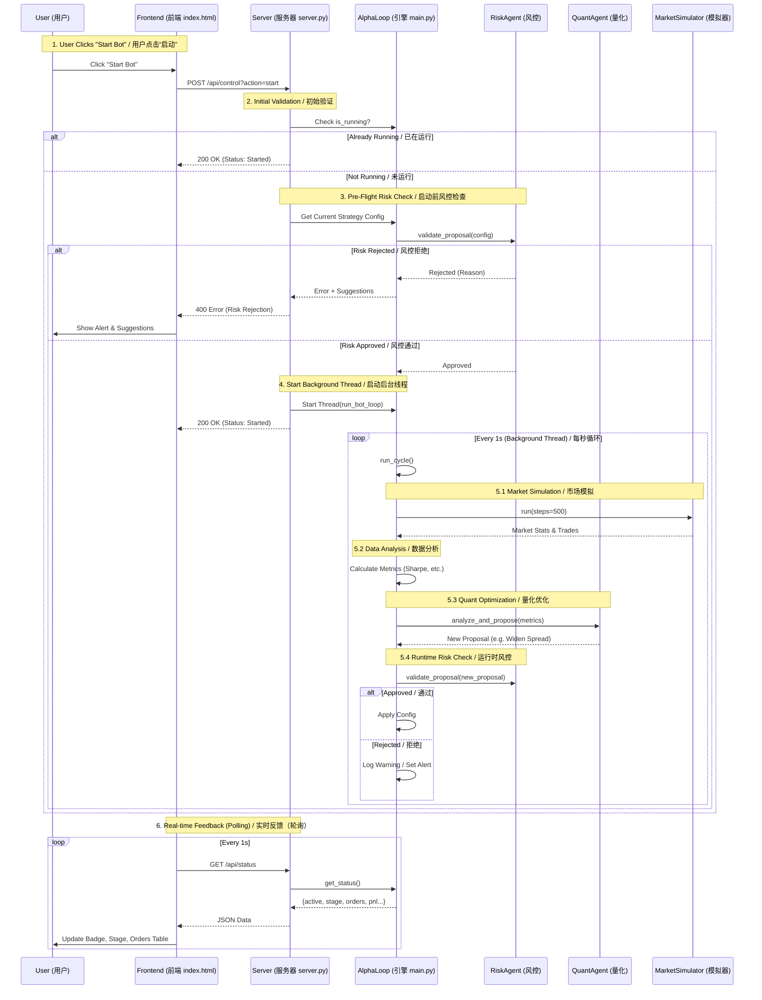

# AlphaLoop System Flow: "Start Bot" Execution / AlphaLoop 系统流程：“启动 Bot”执行

This document outlines the end-to-end interaction flow when a user initiates the "Start Bot" action. It details how the Frontend, Server, and AlphaLoop Engine components interact to execute the trading strategy.

本文档概述了用户启动“Start Bot”操作时的端到端交互流程。详细说明了前端、服务器和 AlphaLoop 引擎组件如何交互以执行交易策略。

## High-Level Architecture / 高层架构

The system consists of three main layers:
系统由三个主要层组成：

1.  **Frontend (UI)**: HTML/JS interface for user control and visualization.
    *   **前端 (UI)**：用于用户控制和可视化的 HTML/JS 界面。
2.  **API Server (FastAPI)**: Handles requests and manages the bot lifecycle.
    *   **API 服务器 (FastAPI)**：处理请求并管理 Bot 生命周期。
3.  **AlphaLoop Engine**: The core logic containing the autonomous agents (Data, Quant, Risk) and Market Simulator.
    *   **AlphaLoop 引擎**：包含自主智能体（数据、量化、风控）和市场模拟器的核心逻辑。

## Interaction Flow Diagram / 交互流程图

## Detailed Step-by-Step Breakdown / 详细步骤分解

### 1. User Action / 用户操作
*   **Action**: User clicks the green "Start Bot" button on the dashboard.
    *   **操作**：用户点击仪表板上的绿色“Start Bot”按钮。
*   **Context**: The user has selected a trading pair (e.g., ETH/USDT) and configured initial parameters (Spread, Quantity).
    *   **背景**：用户已选择交易对（如 ETH/USDT）并配置了初始参数（价差、数量）。

### 2. API Request Handling / API 请求处理 (`server.py`)
*   **Endpoint**: `POST /api/control`
*   **Logic / 逻辑**:
    1.  Checks if the bot is already running.
        *   检查 Bot 是否已在运行。
    2.  **Pre-Flight Risk Check**: Before spawning any threads, the server asks the `RiskAgent` to validate the *current* configuration.
        *   **启动前风控检查**：在生成任何线程之前，服务器要求 `RiskAgent` 验证*当前*配置。
        *   *Why?* To prevent starting the bot with obviously unsafe settings (e.g., spread > 5%).
        *   *原因*：防止以明显不安全的设置（例如价差 > 5%）启动 Bot。
    3.  **If Rejected**: Returns an error immediately with suggestions (e.g., "Spread too wide"). The bot **does not start**.
        *   **如果拒绝**：立即返回错误并提供建议（例如“价差太宽”）。Bot **不会启动**。
    4.  **If Approved**: Sets `is_running = True` and spawns a background thread (`run_bot_loop`).
        *   **如果批准**：设置 `is_running = True` 并生成后台线程 (`run_bot_loop`)。

### 3. Background Execution Loop / 后台执行循环 (`src/trading/engine.py`)
Once started, the `AlphaLoop` runs continuously in a background thread. Each cycle involves:
一旦启动，`AlphaLoop` 将在后台线程中持续运行。每个周期包括：

1.  **Stage: Market Simulation / 阶段：市场模拟**
    *   The `MarketSimulator` generates synthetic market data (random walk price) and simulates order execution based on the current strategy.
        *   `MarketSimulator` 生成合成市场数据（随机游走价格）并根据当前策略模拟订单执行。
    *   It produces `trades` and `market_stats`.
        *   它产生 `trades`（交易）和 `market_stats`（市场统计）。

2.  **Stage: Data Analysis / 阶段：数据分析**
    *   The `DataAgent` ingests the simulation results.
        *   `DataAgent` 摄取模拟结果。
    *   It calculates high-level metrics: `Sharpe Ratio`, `Win Rate`, `Volatility`.
        *   它计算高级指标：`夏普比率`、`胜率`、`波动率`。

3.  **Stage: Quant Strategy / 阶段：量化策略**
    *   The `QuantAgent` analyzes the metrics.
        *   `QuantAgent` 分析指标。
    *   **Logic / 逻辑**:
        *   If performance is low (low Sharpe), it proposes **widening the spread** to capture more PnL per trade.
            *   如果表现不佳（夏普比率低），它建议**扩大价差**以在每笔交易中获取更多盈亏。
        *   If performance is high (high Win Rate), it proposes **tightening the spread** to capture more volume.
            *   如果表现良好（胜率高），它建议**收紧价差**以获取更多交易量。

4.  **Stage: Risk Check (Runtime) / 阶段：风控检查（运行时）**
    *   Any proposal from the Quant Agent must pass the `RiskAgent`.
        *   来自量化智能体的任何提议都必须通过 `RiskAgent`。
    *   **Logic / 逻辑**: Checks hard constraints (e.g., `MAX_SPREAD = 5%`).
        *   检查硬性约束（例如 `MAX_SPREAD = 5%`）。
    *   If the strategy tries to widen the spread too much (e.g., > 5%), the Risk Agent **blocks** the update and triggers a system alert.
        *   如果策略试图过度扩大价差（例如 > 5%），风控智能体将**阻止**更新并触发系统警报。

5.  **Stage: Execution / 阶段：执行**
    *   If approved, the new configuration is applied to the strategy.
        *   如果获得批准，新配置将应用于策略。

### 4. Frontend Feedback Loop / 前端反馈循环
The UI does not wait for the background loop. Instead, it polls the server to reflect the current state.
UI 不等待后台循环。相反，它轮询服务器以反映当前状态。

*   **Polling**: Every 1 second, `index.html` calls `GET /api/status`.
    *   **轮询**：`index.html` 每 1 秒调用一次 `GET /api/status`。
*   **Data Displayed / 显示的数据**:
    *   **Bot Status**: STOPPED / RUNNING (Green Badge).
        *   **Bot 状态**：停止 / 运行（绿色徽章）。
    *   **Stage**: Shows the current internal step (e.g., "Risk Checking...", "Execution").
        *   **阶段**：显示当前内部步骤（例如“风控检查中...”、“执行”）。
    *   **Active Orders**: Displays the orders currently placed by the strategy.
        *   **活跃订单**：显示策略当前下的订单。
    *   **Alerts**: If a runtime risk check fails, an amber alert box appears explaining why.
        *   **警报**：如果运行时风控检查失败，会出现一个琥珀色警报框解释原因。

## Key Design Principles Demonstrated / 展示的关键设计原则
*   **Segregation of Duties**: The *Quant Agent* (Optimization) is separate from the *Risk Agent* (Safety). The Quant Agent can try to be aggressive, but the Risk Agent acts as a hard brake.
    *   **职责分离**：*量化智能体*（优化）与*风控智能体*（安全）是分开的。量化智能体可以尝试激进，但风控智能体充当硬性刹车。
*   **Asynchronous Feedback**: The user interface remains responsive while the heavy computation (simulation/optimization) happens in the background.
    *   **异步反馈**：在后台进行繁重计算（模拟/优化）时，用户界面保持响应。
*   **Transparency**: The "Stage" indicator provides visibility into the "black box" of the autonomous loop.
    *   **透明度**：“阶段”指示器提供了对自主循环“黑匣子”的可视性。
