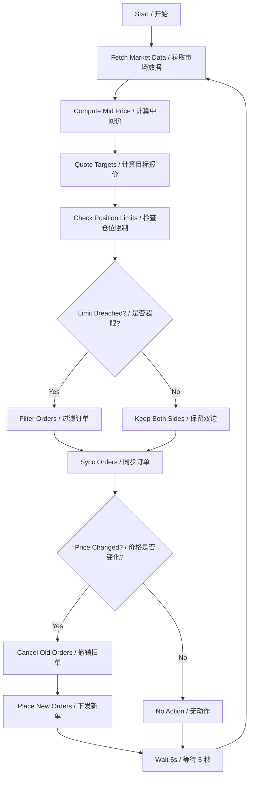

# Trading Strategy Guide / 交易策略说明

## Strategy Summary / 策略概述
The **Fixed-Spread Market Making Strategy** continuously posts symmetric bid and ask orders ±0.2% around the mid-price of the ETH/USDT perpetual contract on Binance Futures Testnet, harvesting the spread while respecting an absolute inventory cap of ±0.2 ETH.
**固定价差双边做市策略**会围绕币安期货测试网 ETH/USDT 永续合约的中间价上下各 0.2% 挂出对称买卖限价单，通过赚取价差获利，并严格遵守 ±0.2 ETH 的绝对仓位上限。

---

## Beginner-Friendly Walkthrough / 面向初学者的详解

### What Is Market Making? / 什么是做市？
Imagine running a fruit stand: you **buy** apples at ¥9.8 and **sell** them at ¥10.2, keeping the ¥0.4 spread as profit.
想象你经营一个水果摊：以 ¥9.8 **收购** 苹果，再以 ¥10.2 **出售**，中间 ¥0.4 的差价就是利润。

Market makers do the same thing with digital assets—providing both bids and asks so that traders can always execute quickly.
做市商在加密交易所中扮演同样的角色——同时提供买卖报价，确保其他交易者能够随时成交。

---

### How the Strategy Operates / 策略的运作方式

#### 1. Instrument & Venue / 标的与场景
- **Pair**: ETH/USDT perpetual futures
  **交易对**：ETH/USDT 永续合约
- **Venue**: Binance Futures Testnet
  **平台**：币安期货测试网
- **Cadence**: Recalculate quotes every 5 seconds
  **频率**：每 5 秒重算一次报价

#### 2. Core Loop: Two-Sided Quotes / 核心循环：双边报价
Every cycle the bot performs four deterministic steps:
机器人在每个循环会执行四个确定性步骤：

##### Step 1: Fetch Market Prices / 步骤 1：获取市场价格
- Read the best bid and best ask from the order book, then compute the mid-price = (bid + ask) / 2.
  读取订单簿中的最优买价和最优卖价，并计算中间价 = (买价 + 卖价) / 2。
- Example: Bid $2,869.50, Ask $2,870.50 → Mid = $2,870.00.
  示例：买价 $2,869.50，卖价 $2,870.50 → 中间价 $2,870.00。

##### Step 2: Derive Target Quotes / 步骤 2：计算目标报价
- Bid Price = Mid × (1 − 0.002) = $2,870 × 0.998 = **$2,864.26**.
  买价 = 中间价 × (1 − 0.002) = $2,870 × 0.998 = **$2,864.26**。
- Ask Price = Mid × (1 + 0.002) = $2,870 × 1.002 = **$2,875.74**.
  卖价 = 中间价 × (1 + 0.002) = $2,870 × 1.002 = **$2,875.74**。
- Spread = Ask − Bid = **$11.48** (0.4%).
  价差 = 卖价 − 买价 = **$11.48**（0.4%）。

##### Step 3: Synchronize Orders / 步骤 3：同步订单
- Compare currently resting orders with the new targets; cancel anything stale and place updated orders.
  将当前挂单与新目标比较，取消过期订单并下发新的目标订单。
- If prices did not move, keep existing orders to avoid unnecessary churn.
  若价格未变化，则保留现有订单，避免多余操作。

##### Step 4: Execute Post-Only Orders / 步骤 4：执行 Post-Only 订单
- Submit 0.02 ETH buy/sell orders flagged as **Post-Only (GTX)** so they add liquidity instead of crossing the spread.
  以 **Post-Only (GTX)** 标志提交 0.02 ETH 买/卖单，确保只能作为挂单提供流动性。

#### 3. Order Type: Post-Only / 订单类型：Post-Only
- **Benefit**: Earn maker rebates and avoid taker fees or slippage.
  **优势**：赚取 Maker 返佣，避免 Taker 费用和滑点。
- **Guarantee**: If an order would immediately match, the exchange rejects it so the bot can re-price.
  **机制**：若订单会立即成交，交易所会拒绝，从而让机器人重新定价。

---

### Profit Mechanics / 盈利机制
**Ideal Case**
1. Bid fills at $2,864.26 → Long 0.02 ETH.
2. Ask fills at $2,875.74 → Flat position.
3. Profit = ($2,875.74 − $2,864.26) × 0.02 = **$0.23** (before fees).

**理想情况**
1. 买单在 $2,864.26 成交 → 做多 0.02 ETH。
2. 卖单在 $2,875.74 成交 → 回到空仓。
3. 利润 = ($2,875.74 − $2,864.26) × 0.02 = **$0.23**（未计手续费）。

**Reality Check**
- Market may only fill one side (inventory risk).
- Fees, funding payments, and latency all chip away at PnL.

**现实考量**
- 市场可能只成交单侧，造成库存风险。
- 手续费、资金费率和延迟都会侵蚀利润。

---

## Risk Management / 风险管理

### 1. Absolute Inventory Caps / 绝对仓位限制
- Max long position: **+0.2 ETH**.
  最多持有 **+0.2 ETH** 多头。
- Max short position: **−0.2 ETH**.
  最多持有 **−0.2 ETH** 空头。
- If the cap is reached, the bot only quotes the opposite side until inventory returns to neutral.
  当触及上限时，机器人只在反方向继续挂单，直到仓位回归中性。

### 2. Continuous Repricing / 持续调价
- Quotes refresh every 5 seconds to stay centered on the market.
  报价每 5 秒刷新一次，始终围绕市场价格。
- Stale orders are cancelled to prevent fills at outdated levels.
  及时撤销过期订单，避免以落后价格成交。

---

## Parameter Configuration / 参数配置

| Parameter / 参数 | Current Value / 当前值 | Notes / 说明 |
|------------------|------------------------|--------------|
| Trading Pair | ETH/USDT:USDT | Perpetual futures contract / 永续合约 |
| Spread | 0.2% | Distance from mid-price / 距离中间价百分比 |
| Order Size | 0.02 ETH | Fixed notional per order / 每笔固定数量 |
| Max Position | ±0.2 ETH | Hard inventory cap / 仓位硬上限 |
| Refresh Interval | 5 seconds | Strategy recalculation cadence / 策略刷新频率 |
| Leverage | 5x | Futures leverage multiplier / 合约杠杆倍数 |

---

## Strategy Advantages / 策略优势
- **Stable income**: Earn predictable spread per round trip.
  **稳定收益**：每轮交易获取可预测价差。
- **Liquidity provider**: Qualifies for maker rebates and improves book depth.
  **流动性提供者**：可获得 Maker 返佣并提升盘口深度。
- **Risk aware**: Absolute position caps prevent runaway exposure.
  **风险可控**：绝对仓位上限防止敞口失控。
- **High frequency adjustments**: 5-second cadence keeps orders aligned with market moves.
  **高频调整**：5 秒节奏确保报价紧跟市场。

## Strategy Limitations / 策略局限
- **Directional moves**: Trending markets may fill only one side and accumulate inventory.
  **单边行情**：趋势市可能只成交单侧导致库存积压。
- **Fill dependency**: Requires price oscillations to touch both quotes.
  **成交依赖**：需要价格来回波动才能撮合双边。
- **No inventory skew (yet)**: Current version keeps symmetric spreads regardless of exposure.
  **尚未实现仓位倾斜**：当前始终保持对称价差。

---

## Future Enhancements (Phase 3) / 未来优化（阶段 3）
1. **Inventory Skew** – Tighten the spread on the side that reduces exposure, widen it on the side that adds risk.
   **库存倾斜** —— 在降低仓位的一侧收紧价差，在增加风险的一侧放宽价差。
2. **Volatility-Aware Spread** – Expand spreads during high volatility, compress them when the market is calm.
   **波动率自适应价差** —— 高波动时放大价差，平静时收窄。
3. **Multi-Level Quoting** – Maintain multiple layers of orders to improve fill probability.
   **多层挂单** —— 在不同价位同时挂多层订单，提高成交率。

---

## Code Reference / 代码实现概览

```
market_maker/
├── strategy.py         # Strategy math (±0.2% spread) / 策略逻辑（±0.2% 价差）
├── order_manager.py    # Order synchronization / 订单同步
├── risk.py             # Inventory guardrails / 仓位风控
├── exchange.py         # Binance API adapter / Binance API 适配层
└── main.py             # 5-second control loop / 5 秒控制循环
```

### Strategy Flow Diagram / 策略流程图


---

## Summary / 总结
The fixed-spread market-making strategy is a battle-tested approach for liquid markets. By pairing symmetric quotes with strict position caps and rapid refreshes, AlphaLoop delivers predictable spread capture while laying the groundwork for more advanced, inventory-aware tactics.
固定价差做市策略在高流动性市场中经受了长期考验。AlphaLoop 通过对称报价、严格仓位限制以及快速刷新，实现可预测的价差收益，并为未来更智能的仓位自适应策略打下基础。
