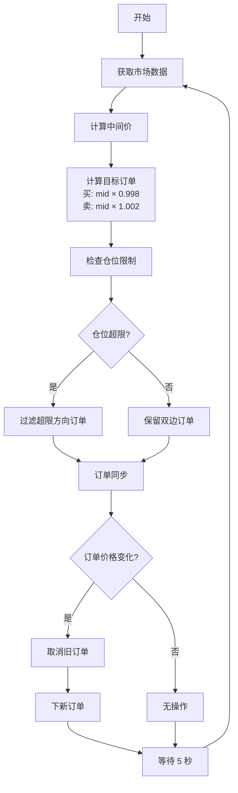

# 交易策略说明

## 策略概述（一句话总结）

**固定价差双边做市策略（Fixed-Spread Market Making）**：在 ETH/USDT 永续合约上，围绕市场中间价上下各 0.2% 的位置持续挂出买卖限价单（Post-Only），通过赚取买卖价差获利，同时设置绝对仓位限制（±0.2 ETH）控制风险。

---

## 策略详解（面向初学者）

### 什么是做市（Market Making）？

想象您在一个菜市场开了一个水果摊：
- 您以 **¥9.8** 的价格**收购**苹果（买单）
- 您以 **¥10.2** 的价格**出售**苹果（卖单）
- 中间的 **¥0.4** 就是您的利润（价差/Spread）

**做市商在加密货币交易所做的就是同样的事情**，只不过交易的是数字资产。

---

### 我们的策略是如何运作的？

#### 1. **标的资产**
- **交易对**: ETH/USDT（以太坊/美元稳定币）
- **合约类型**: **永续合约**（类似期货，但没有到期日）
- **平台**: Binance Futures Testnet（币安期货测试网）

#### 2. **核心逻辑：双边挂单**

每隔 **5 秒**，机器人会执行以下步骤：

##### Step 1: 获取市场价格
- 获取当前 ETH 的**最优买价**和**最优卖价**
- 计算**中间价**（Mid Price）= (最优买价 + 最优卖价) / 2
- 例如：最优买价 $2,869.50，最优卖价 $2,870.50 → 中间价 = $2,870.00

##### Step 2: 计算目标订单价格
- **买单价格** = 中间价 × (1 - 0.002) = $2,870.00 × 0.998 = **$2,864.26**
- **卖单价格** = 中间价 × (1 + 0.002) = $2,870.00 × 1.002 = **$2,875.74**
- **价差** = $2,875.74 - $2,864.26 = **$11.48**（0.4%）

##### Step 3: 同步订单
- 检查当前挂单是否与新价格一致
- 如果**不一致**（市场价格波动）：
  - 取消旧订单
  - 下新订单
- 如果**一致**：不操作

##### Step 4: 执行订单
- **买单**: 在 $2,864.26 挂出 **0.02 ETH** 的买单（Post-Only）
- **卖单**: 在 $2,875.74 挂出 **0.02 ETH** 的卖单（Post-Only）

#### 3. **订单类型：Post-Only（只做 Maker）**

- **Post-Only (GTX)**: 订单只会作为**挂单**进入订单簿，不会立即成交
- **好处**：
  - 获得 **Maker 手续费返佣**（币安期货 Maker 费率通常为负值，即返佣）
  - 避免立即成交导致的滑点

#### 4. **盈利机制**

**理想情况**：
1. 买单在 $2,864.26 被成交 → 做多 0.02 ETH
2. 卖单在 $2,875.74 被成交 → 平仓 0.02 ETH
3. **利润** = ($2,875.74 - $2,864.26) × 0.02 = **$0.23** (不含手续费)

**实际情况**：
- 市场价格波动，订单不一定立即成交
- 可能只成交一边（单边风险）
- 需要通过仓位管理控制风险

---

### 风险管理

#### 1. **绝对仓位限制**
- **最大多头仓位**: +0.2 ETH
- **最大空头仓位**: -0.2 ETH
- **超限行为**：
  - 达到 +0.2 ETH → 停止挂买单，只挂卖单
  - 达到 -0.2 ETH → 停止挂卖单，只挂买单

**为什么需要仓位限制？**
- 防止单边行情导致仓位过大
- 控制最大风险敞口

#### 2. **动态调整**
- 每 5 秒重新计算订单价格
- 确保订单始终围绕市场价格
- 如果价格偏离过多，及时取消重挂

---

### 参数配置

| 参数 | 当前值 | 说明 |
|------|--------|------|
| **交易对** | ETH/USDT:USDT | 以太坊永续合约 |
| **价差** | 0.2% | 买卖单距离中间价的百分比 |
| **订单数量** | 0.02 ETH | 每单固定数量 |
| **最大仓位** | ±0.2 ETH | 绝对仓位限制 |
| **刷新间隔** | 5 秒 | 策略重算频率 |
| **杠杆** | 5x | 期货合约杠杆倍数 |

---

### 策略优势

✅ **稳定性**：不依赖方向性预测，通过价差获利  
✅ **流动性提供**：作为 Maker 为市场提供流动性，获得返佣  
✅ **风险可控**：仓位限制确保最大风险敞口可控  
✅ **高频调整**：5 秒刷新确保价格始终跟随市场  

### 策略局限

❌ **波动市场风险**：剧烈单边行情可能导致单边持仓  
❌ **成交率依赖市场**：需要市场价格波动触及挂单才能成交  
❌ **无库存倾斜**（当前版本）：未根据仓位调整价差（Phase 3 计划实现）  

---

### 未来优化方向（Phase 3）

1. **库存倾斜（Inventory Skew）**：
   - 当前仓位 > 0（做多过多）→ 调宽卖单价差，收窄买单价差
   - 当前仓位 < 0（做空过多）→ 调宽买单价差，收窄卖单价差
   - 目的：加速平衡仓位

2. **动态价差**：
   - 根据市场波动率调整价差
   - 波动率高 → 价差加宽（降低风险）
   - 波动率低 → 价差收窄（提高成交率）

3. **多层挂单**：
   - 不止一层买卖单，而是多个价位的订单
   - 提高成交率和流动性

---

## 代码实现概览

### 核心模块

```
market_maker/
├── strategy.py         # 策略计算（价格 ± 0.2%）
├── order_manager.py    # 订单同步（取消/下单）
├── risk.py             # 风险管理（仓位限制）
├── exchange.py         # 交易所接口（Binance API）
└── main.py             # 主循环（5 秒一次）
```

### 策略流程图



---

## 总结

这是一个**经典的做市策略**，适合在流动性较好的市场中运行。通过持续提供双边流动性，赚取买卖价差。当前实现为 MVP 版本，已具备核心功能和基础风险管理，后续可通过库存倾斜、动态价差等优化提升策略表现。
